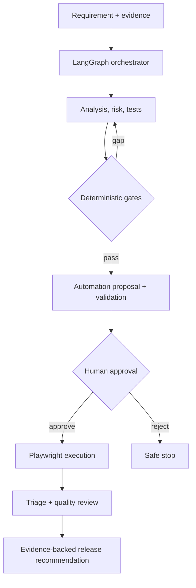

# Agentic Quality Engineering Platform

[](https://github.com/ashokmanohar-ai/agentic-quality-engineering-platform/actions/workflows/ci.yml)
[](https://www.python.org/)
[](https://nodejs.org/)
[](LICENSE)

> **Recruiter signal:** governed Agentic Quality Engineering with nine specialised QE agents, explicit LangGraph state, deterministic controls, hash-bound human approval and real Playwright execution evidence.

**Part of the broader AI Quality Engineering portfolio:** [Live AI Assurance Portfolio](https://enterprise-ai-quality-portfolio-recruiter-showcase-v700x0.v2.appdeploy.ai/)

## The problem

A single autonomous “super-agent” can hide invented requirements, unsafe automation, weak traceability and unjustified release confidence.

This platform demonstrates a different approach: **narrow agent responsibilities + structured outputs + deterministic controls + explicit human approval + persisted evidence**.

## Architecture



## End-to-end workflow

**Requirement → Requirement Analysis → Risk Analysis → Test Design → Coverage Gate → Regression Selection → Automation Generation → Static/Compiler Validation → Human Approval → Playwright Execution → Failure Triage → Quality Review → Release Recommendation**

## Agent catalogue

| Agent | Responsibility | Deterministic control |
| --- | --- | --- |
| Requirement Analyst | Extract facts and expose ambiguity | Empty/duplicate/missing-criteria checks |
| Risk Analyst | Propose risk and tests | Risk score + level calculation |
| Test Designer | Create traceable cases | Non-orphan schema validation |
| Coverage Reviewer | Identify gaps | Coverage percentages + thresholds |
| Regression Selector | Select impacted tests | Git diff parser is source of truth |
| Automation Generator | Propose Playwright code | Safe path + static code policy |
| Execution Agent | Execute approved artifact | Hash-bound approval + fixed command |
| Failure Triage | Classify observed failure | Confidence thresholds + UNKNOWN fallback |
| Quality Reviewer | Explain release risk | Mandatory gates cannot be overridden by AI |

## Engineering evidence

- **9 specialised QE agents** with explicit contracts
- Persisted workflow checkpoints and audit events
- Pydantic v2 structured outputs
- Deterministic risk, coverage, traceability and release calculations
- Real Playwright JSON parsing—no fabricated test results
- Hash-bound approval of generated automation
- RBAC with VIEWER / QUALITY_ENGINEER / APPROVER / ADMIN
- Tenant/project scoping
- Static code safety policy for generated tests
- Mock provider for zero-cost deterministic CI
- Optional Azure OpenAI, OpenAI-compatible and Anthropic adapters
- OpenTelemetry-ready instrumentation and optional Phoenix
- Docker + FastAPI/OpenAPI + GitHub Actions

## Measurable controls

The bundled evaluation set contains **36 cases** covering requirement ambiguity, security, integration failures, regression selection, automation/data/environment/network failures, prompt injection, path/command safety, coverage, release decisions, approvals, malformed model output, loop guards, tenancy, secret masking and traceability.

Default evaluation gates include:

- **≥99% structured validity**
- **100% traceability**
- **≥98% tool correctness**
- **≤2% unsupported-reference rate**

These are reference-framework thresholds, not customer production claims.

## 5-minute proof

```bash
cp .env.example .env
# set JWT_SECRET and DEMO_PASSWORD
docker compose up --build -d
docker compose exec api python scripts/seed_demo.py
```

Open:

- `http://localhost:8080` — dashboard
- `http://localhost:8080/docs` — OpenAPI

Expected proof: a seeded, reviewable workflow with persisted state, agent evidence, human-approval boundaries and release recommendation.

## Quality controls by stage

### Requirement, risk and design

Basic requirement checks run before AI. Agents surface ambiguity rather than filling gaps. Every test must reference a requirement and acceptance criterion. Risk levels are calculated in code.

### Coverage and regression

Coverage percentages come from IDs, never model estimates. Changed-file evidence comes from a fixed git-diff tool. Critical requirement/risk coverage is gated deterministically.

### Automation and execution

Generated files are restricted to `automation/playwright/generated/*.spec.ts`. Static policy blocks traversal, sleeps, brittle XPath, embedded passwords, focused/skipped tests and shell APIs. Validation happens before approval; execution uses fixed commands only.

### Triage and release

Triage separates evidence from hypothesis. Low confidence becomes `UNKNOWN`. Mandatory failures force `FAIL`; AI narrative cannot override deterministic policy.

## Security and governance

- Uploaded content is delimited and treated as untrusted
- No arbitrary shell tool is exposed
- Generated file paths stay inside a dedicated workspace
- Approval and execution enforce roles and tenant/project scope
- Secrets are environment-based and masked
- Approval is bound to artifact content hash
- Human overrides retain original decision, reason, approver and timestamp

## Technology stack

`Python 3.12` · `FastAPI` · `Pydantic v2` · `LangGraph` · `SQLite` · `Playwright` · `TypeScript` · `Node.js 22` · `OpenTelemetry` · `Phoenix` · `Pytest` · `Ruff` · `MyPy` · `GitHub Actions`

## Repository map

```text
app/                    FastAPI, agents, orchestration, tools, policies
automation/playwright/  Governed TypeScript validation and execution
config/                 Deterministic quality-gate policy
datasets/               36-case evaluation set and demo requirements
prompts/                Versioned prompt templates outside code
scripts/                Demo seeding, prompt checks, evaluation, reports
tests/                  Unit, agent, integration, orchestration, security
docs/                   Architecture, governance, security, interviews
.github/workflows/      CI, agent evaluation, nightly quality
```

## Recruiter demo path

1. Show the explicit LangGraph workflow.
2. Open one agent contract and deterministic gate.
3. Demonstrate hash-bound automation approval.
4. Show real Playwright execution evidence.
5. Show failure triage with `UNKNOWN` fallback.
6. Finish with the release recommendation and audit evidence.
7. Connect the story to the [live AI Assurance portfolio](https://enterprise-ai-quality-portfolio-recruiter-showcase-v700x0.v2.appdeploy.ai/).

## Documentation

- [Architecture](docs/architecture.md)
- [Agent Design](docs/agent-design.md)
- [Orchestration](docs/orchestration.md)
- [Agent Evaluation](docs/agent-evaluation.md)
- [Observability](docs/observability.md)
- [Security](docs/security.md)
- [Human in the Loop](docs/human-in-the-loop.md)
- [AI Governance](docs/ai-governance.md)
- [Interview Walkthrough](docs/interview-walkthrough.md)

## Limitations

The mock provider validates framework contracts and routing, not real-model semantic quality. Generated automation always requires engineering review. SQLite is the default reference store. Production deployment should replace local auth with enterprise identity, durable databases and environment-specific governance.

## Role alignment

**AI Quality Architect · Agentic AI Quality Engineer · Test Architect · Quality Engineering Architect · Forward Deployed AI Engineer**

## Contributing and licence

See [CONTRIBUTING.md](CONTRIBUTING.md), [SECURITY.md](SECURITY.md) and the [MIT License](LICENSE).
