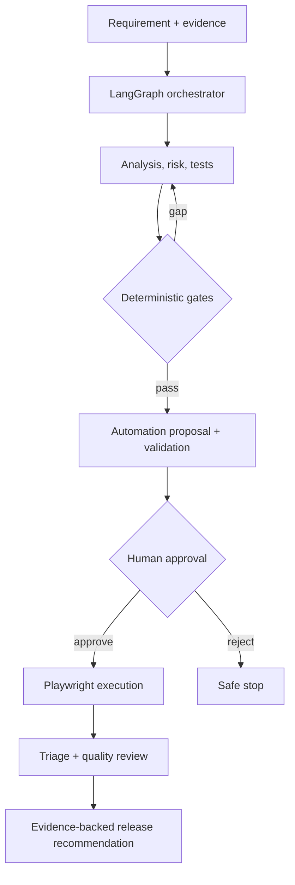

# Agentic Quality Engineering Platform

An enterprise-style reference implementation demonstrating how specialised AI agents can support requirement analysis, risk-based test design, regression selection, automation generation, execution, failure triage, quality evaluation, and release-readiness decisions with human governance and measurable AI evaluation.

[](https://github.com/ashokmanohar-ai/agentic-quality-engineering-platform/actions/workflows/ci.yml)
[](https://www.python.org/)
[](https://nodejs.org/)
[](LICENSE)

## Why Agentic Quality Engineering?

Quality engineers need help turning incomplete requirements, risk, code changes, historical evidence, and test results into defensible decisions. A single prompt or autonomous “super-agent” hides too much. This platform uses narrow agent responsibilities, explicit LangGraph state, schema validation, deterministic calculations, fixed tools, human approval, and persisted evidence.

> Agents assist Quality Engineering decisions. They do not remove engineering controls.

The project demonstrates both sides of Agentic QE: using agents to improve software quality, and engineering, testing, evaluating, governing, and observing the agents themselves.

## Key Features

- Nine specialised QE agents with clear inputs, outputs, and restrictions
- Explicit LangGraph workflows with checkpoints, pause/resume, retry bounds, and loop guards
- Pydantic v2 structured outputs; malformed outputs fail safely
- Transparent risk score: probability × impact
- Deterministic traceability, coverage, evaluation, and release gates
- Risk-based regression selection grounded only in parsed git diff evidence
- Playwright TypeScript generation with static policy, lint, typecheck, discovery, and human approval gates
- Real Playwright JSON result parsing—no fabricated test results
- Evidence-aware failure triage with confidence thresholds and `UNKNOWN` fallback
- Mock provider for zero-cost CI; optional Azure OpenAI, OpenAI-compatible, and Anthropic adapters
- SQLite local persistence with project/tenant scope, audit events, agent runs, approvals, tokens, latency, and prompt versions
- Optional project knowledge retrieval with source IDs and scores
- JWT demo authentication and `VIEWER`, `QUALITY_ENGINEER`, `APPROVER`, `ADMIN` roles
- OpenTelemetry-ready spans and opt-in Phoenix service
- FastAPI/OpenAPI, a lightweight dashboard, Docker, and three GitHub Actions workflows

## Architecture



All important state is persisted, and every high-impact transition retains actor, timestamp, evidence, decision, and artifact hash. See [architecture](docs/architecture.md) and [orchestration](docs/orchestration.md).

## Agent Catalogue

| Agent | Responsibility | Deterministic control |
|---|---|---|
| Requirement Analyst | Extract facts and expose ambiguity | Empty, short, duplicate, and missing-criteria checks |
| Risk Analyst | Propose risk, rationale, and tests | Score and level calculation |
| Test Designer | Propose traceable cases | Non-orphan schema validation |
| Coverage Reviewer | Identify gaps | Percentages and mandatory thresholds |
| Regression Selector | Classify existing tests | Git diff parser is source of truth |
| Automation Generator | Propose Playwright code | Safe path and static code policy |
| Execution Agent | Run approved artifacts | Hash-bound approval and fixed command |
| Failure Triage | Classify actual failures | Confidence thresholds and `UNKNOWN` fallback |
| Quality Reviewer | Explain release risk | Mandatory release gates cannot be overridden by AI |

Detailed contracts and failure modes are in [agent design](docs/agent-design.md).

## Workflow

```text
Requirement → Requirement Analysis → Risk Analysis → Test Design
→ Coverage Gate → Regression Selection → Automation Generation
→ Static/Compiler Validation → Human Approval → Playwright Execution
→ Failure Triage → Quality Review → Release Recommendation
```

The workflow pauses at `AUTOMATION_REVIEW`. An approver can accept or reject the exact artifact hash. A separately governed record is required to override a completed release recommendation; the original decision is never replaced in the audit history.

## Technology Stack

- Python 3.12, FastAPI, Pydantic v2, Uvicorn
- LangGraph explicit stateful orchestration
- SQLite by default; repository interface isolates persistence
- Playwright, TypeScript, Node.js 22
- OpenTelemetry; optional Arize Phoenix container profile
- Pytest, Ruff, MyPy, ESLint, Prettier, GitHub Actions

## Repository Structure

```text
app/                    FastAPI, agents, orchestration, tools, policies
automation/playwright/  Governed TypeScript validation and execution
config/                 Deterministic quality-gate policy
datasets/               36-case evaluation set and demo requirements
prompts/                Versioned prompt templates outside code
scripts/                Demo seeding, prompt checks, evaluation, reports
tests/                  Unit, agent, integration, orchestration, security
docs/                   Architecture, governance, security, interviews
.github/workflows/      CI, agent evaluation, nightly quality
```

## Getting Started

### Docker (recommended)

```bash
cp .env.example .env
## Set JWT_SECRET and DEMO_PASSWORD in .env before starting.
docker compose up --build -d
curl http://localhost:8080/health
docker compose exec api python scripts/seed_demo.py
```

Open `http://localhost:8080` for the dashboard or `http://localhost:8080/docs` for OpenAPI. Enable optional local Phoenix with:

```bash
docker compose --profile observability up -d
```

### Local development

```bash
python -m venv .venv
source .venv/bin/activate
python -m pip install -e '.[dev]'
cp .env.example .env
## Set JWT_SECRET and DEMO_PASSWORD in .env before starting.
python scripts/seed_demo.py
uvicorn app.main:app --reload --port 8080
```

Windows PowerShell activation is `.venv\Scripts\Activate.ps1`.

Install the isolated automation workspace:

```bash
cd automation/playwright
npm ci
npx playwright install chromium
npm run lint
npm run typecheck
npm test
```

## Configuration and Offline Mode

`MODEL_PROVIDER=mock` is the safe default. It produces deterministic structured fixtures, reports zero token cost, and makes API, workflow, and evaluation testing reproducible without credentials. Low temperature, structured schemas, prompt versions, fixed datasets, and deterministic tools improve repeatability; real model output can still vary.

Copy `.env.example`; never commit `.env`. Provider credentials are loaded only by the selected optional adapter. Telemetry is disabled by default and secret masking is applied before structured logs/audit payloads.

## Run a Workflow through the API

Get a demo token after changing `DEMO_PASSWORD` in `.env`:

```bash
curl -s http://localhost:8080/api/v1/auth/token \
  -H 'Content-Type: application/json' \
  -d '{"username":"qe","password":"YOUR_DEMO_PASSWORD","role":"QUALITY_ENGINEER","tenant_id":"default"}'
```

Demo usernames have fixed roles: `viewer`, `qe`, `approver`, and `admin`. A caller cannot assign a different role in the token request. The shared demo password is intentionally local-only.

Create a project and requirement, then start the graph:

```bash
curl -X POST http://localhost:8080/api/v1/projects \
  -H "Authorization: Bearer $TOKEN" -H 'Content-Type: application/json' \
  -d '{"id":"demo","name":"Interview Demo"}'

curl -X POST http://localhost:8080/api/v1/requirements \
  -H "Authorization: Bearer $TOKEN" -H 'Content-Type: application/json' \
  --data @datasets/requirements/password-reset.json

curl -X POST http://localhost:8080/api/v1/workflows \
  -H "Authorization: Bearer $TOKEN" -H 'Content-Type: application/json' \
  -d '{"project_id":"demo","requirement_id":"REQ-PASSWORD-RESET"}'
```

Use an `APPROVER` token to approve the reported artifact hash, then use an authorised engineering token to call `/api/v1/workflows/{id}/execute`. The report endpoint returns requirements, risks, tests, automation, execution, triage, timeline, and release evidence.

## Quality Controls by Stage

### Requirement, risk, and test design

Basic requirement checks run before AI. Agents surface ambiguity instead of filling gaps. Every test must reference a requirement and acceptance criterion; risk references are preserved where applicable. Risk scores and levels are calculated in code.

### Coverage and regression

Coverage percentages are computed from IDs, never estimated by a model. Default gates require 100% critical requirement and critical risk coverage and at least 90% overall coverage. Regression confidence is advisory and all changed-file evidence comes from the fixed git diff tool.

### Automation and execution

Generated files are restricted to `automation/playwright/generated/*.spec.ts`. Static policy blocks traversal, sleeps, brittle XPath, embedded passwords, focused/skipped tests, and shell APIs. Validation precedes hash-bound human approval. The execution adapter accepts no model-supplied command and parses actual Playwright JSON.

### Triage and release decision

Triage separates evidence from hypothesis. Low confidence becomes `UNKNOWN`. Mandatory failures—coverage gate failure, failed critical execution, or unresolved product defect—force `FAIL`. Warnings can yield `CONDITIONAL_PASS`. AI supplies narrative only; it cannot override deterministic policy.

## Agent Evaluation

The bundled 36-case dataset covers clear and ambiguous requirements, security, integrations, regressions, automation/data/environment/network failures, prompt injection, path and command safety, coverage, release decisions, approvals, model failure, malformed output, loop guards, tenancy, secret masking, and traceability.

```bash
python scripts/run_evaluations.py --provider mock
```

Default gates: ≥99% structured validity, 100% traceability, ≥98% tool correctness, and ≤2% unsupported-reference rate. LLM-as-a-Judge is reserved for qualitative dimensions and uses a structured `JudgeScore`; it is never used for arithmetic or identifier checks. See [agent evaluation](docs/agent-evaluation.md).

## RAG and Retrieval

The optional knowledge layer chunks text deterministically, enforces project scope, and returns source ID, chunk, and score. The core runs without embeddings. The `rag` extra enables future sentence-transformer/Chroma expansion; retrieval precision, recall, and source correctness must be evaluated before production use.

## Observability

Agent runs retain provider, model, prompt/version, input hash, schema status, latency, tokens, and estimated cost. Audit events capture state transitions, tools, approvals, executions, and decisions. OpenTelemetry is opt-in so sensitive content is not exported by default. See [observability](docs/observability.md).

## Security and Governance

- Uploaded content is explicitly delimited and treated as untrusted data
- No arbitrary shell tool exists; commands are fixed and allow-listed
- Generated file paths are resolved beneath a dedicated workspace
- Approval and execution APIs enforce roles and tenant/project scope
- Secrets are environment-based and masked in audit/log structures
- Automation approval is bound to content hash
- Human overrides preserve original decision, reason, approver, and time

This is a reference implementation, not a compliance certification. Read [security](docs/security.md), [human-in-the-loop](docs/human-in-the-loop.md), and [AI governance](docs/ai-governance.md).

## CI/CD and Validation

`ci.yml` runs Ruff, formatting, MyPy, Pytest, security tests, prompt validation, offline evaluation, TypeScript, ESLint, Prettier, Playwright, and a container build. `agent-evaluation.yml` gates prompt/agent changes. `nightly-quality.yml` repeats the full offline story. Normal PRs never require model credentials.

Run the same checks locally:

```bash
ruff check .
ruff format --check .
mypy app tests
pytest
python scripts/validate_prompts.py
python scripts/run_evaluations.py --provider mock
(cd automation/playwright && npm run format:check && npm run lint && npm run typecheck && npm test)
```

The latest evidence-backed results are recorded in the [validation report](docs/validation-report.md).

## Demonstrations

- **Password Reset:** ambiguity, expiry, password policy, replay/negative/security coverage, and new-login validation.
- **Payment Retry:** high financial risk, idempotency, bounded retries, integration failure, audit, and regression scope.

The [interview walkthrough](docs/interview-walkthrough.md) provides two- and five-minute narratives plus architect-level questions.

## Limitations

- LLM outputs remain probabilistic and depend on requirement quality.
- The mock provider validates contracts and routing, not real-model semantic quality.
- Generated automation always requires engineering review.
- AI triage confidence is not correctness.
- SQLite is the default reference store; high-scale deployment should implement the repository interface on PostgreSQL.
- The local JWT flow is for demonstration; production should use OIDC/Entra ID and managed secrets.
- Lexical retrieval is intentionally simple until measured retrieval needs justify embeddings/reranking.
- Release recommendations support but do not replace organisational governance.

## Roadmap

Measured next steps include PostgreSQL/pgvector storage, production OIDC, Jira/Azure DevOps ingestion adapters, GitHub PR impact evidence, richer trace parsing, OpenInference model spans, and benchmarked hybrid retrieval. They are extensions, not unfinished core controls.

## Contributing and License

See [CONTRIBUTING.md](CONTRIBUTING.md), [SECURITY.md](SECURITY.md), and the [MIT License](LICENSE).
