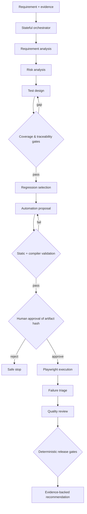
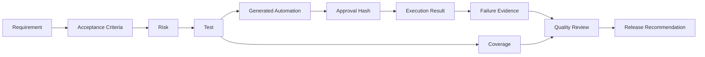

# Agentic Quality Engineering

## A Governed, Evidence-Driven Framework for Testing AI-Powered and Conventional Software Systems

**Technical White Paper — Version 1.0**  
**September 2026**

**Author:** Ashok Kumar Manohar  
**GitHub:** [ashokmanohar-ai](https://github.com/ashokmanohar-ai)  
**Reference implementation:** [Agentic Quality Engineering Platform](https://github.com/ashokmanohar-ai/agentic-quality-engineering-platform)

> **Publication note:** This is an independent technical white paper supported by an open-source reference implementation. It is not a peer-reviewed academic paper, compliance certification, security certification, or statement of production readiness.

---

## Abstract

Generative AI is changing software delivery, but it is also changing what software quality means. Quality Engineering can no longer focus only on deterministic application behavior. Modern systems increasingly include large language models, retrieval-augmented generation (RAG), autonomous or semi-autonomous agents, tool use, generated code, probabilistic decisions, and AI-assisted release workflows. These systems introduce new failure modes: unsupported output, incorrect tool selection, prompt injection, excessive agency, weak traceability, inconsistent responses, unsafe generated automation, hidden assumptions, and overconfident release decisions.

This white paper presents **Agentic Quality Engineering (Agentic QE)** as a governed operating model in which specialized AI agents assist the software quality lifecycle while deterministic engineering controls remain authoritative. The model separates probabilistic reasoning from deterministic policy, constrains agent permissions, preserves evidence, enforces human approval for high-impact actions, and continuously evaluates both the software under test and the AI components involved in the testing process.

A companion open-source reference implementation demonstrates nine specialized QE agents, explicit stateful orchestration, schema-constrained outputs, risk-based test design, traceability and coverage gates, governed Playwright automation generation, hash-bound human approval, real execution evidence, failure triage, release-readiness recommendations, AI evaluation, observability, auditability, and CI/CD integration.

The central proposition is simple:

> **AI can accelerate Quality Engineering, but evidence, policy, security boundaries, and accountable human decisions must remain first-class engineering controls.**

---

## 1. Executive Summary

Traditional test automation answers questions such as:

- Did the application behave as expected?
- Did the API return the correct response?
- Did the regression suite pass?
- Did performance remain within an agreed threshold?

AI-enabled systems add another set of questions:

- Was the model response grounded in approved evidence?
- Did the agent choose the correct tool?
- Was the action within the agent's authority?
- Was generated test code safe to execute?
- Can the release recommendation be traced to objective evidence?
- Did an AI evaluator measure a qualitative property appropriately, or was it used for a task better handled deterministically?
- Can the organization reproduce what happened after the fact?

Agentic QE addresses these questions by combining the strengths of AI reasoning with conventional software-engineering controls.

The framework described in this paper is built around six principles:

1. **Specialized agents instead of an unconstrained super-agent.**
2. **Deterministic controls for arithmetic, identifiers, policy, permissions, and release gates.**
3. **Structured outputs and explicit workflow state rather than opaque conversational state.**
4. **Evidence before action, with traceability from requirements to tests, execution, triage, and release decisions.**
5. **Human approval for consequential actions, especially generated automation and release overrides.**
6. **Continuous evaluation of the agents themselves: correctness, traceability, safety, latency, tokens, cost, and unsupported claims.**

The goal is not maximum autonomy. The goal is **controlled acceleration with measurable quality**.

---

## 2. Why Quality Engineering Must Evolve

### 2.1 Software is becoming probabilistic

Conventional software generally maps a known input to a deterministic code path. AI-enabled software can generate different valid or invalid outputs for similar inputs, retrieve different context, choose among tools, and produce behavior that depends on models, prompts, external knowledge, memory, orchestration state, and model-provider behavior.

This makes traditional pass/fail automation necessary but insufficient.

### 2.2 AI introduces new quality dimensions

A modern quality strategy may need to measure:

| Dimension | Example question |
|---|---|
| Groundedness | Is the answer supported by the retrieved or approved evidence? |
| Relevance | Does the answer address the user's actual request? |
| Retrieval quality | Did the RAG system retrieve the right evidence? |
| Tool correctness | Did the agent call the appropriate tool with valid arguments? |
| Traceability | Can every proposed test and decision be linked to source evidence? |
| Safety | Did the system resist prompt injection or unsafe tool use? |
| Robustness | Does the system behave acceptably under ambiguous, malformed, adversarial, or partial input? |
| Consistency | Are materially equivalent inputs handled within an acceptable variance? |
| Cost efficiency | Are model calls, tokens, latency, and retries proportionate to business value? |
| Governance | Can high-impact actions be authorized, audited, explained, and reversed? |

### 2.3 Agentic systems expand the risk surface

An AI assistant that produces text has a limited action surface. An agent that can read repositories, generate code, call tools, modify test assets, query enterprise systems, and trigger execution has a much larger one.

OWASP's current guidance for LLM and agentic applications highlights risks including prompt injection, excessive agency, sensitive information exposure, unsafe tool interactions, and broader AI security concerns. These risks make authorization boundaries and action controls an engineering requirement rather than an optional governance layer.

---

## 3. Definition: Agentic Quality Engineering

**Agentic Quality Engineering** is the use of specialized AI agents, deterministic engineering controls, evidence-driven workflows, and accountable human oversight to improve software-quality activities while also testing and governing the AI components that participate in those activities.

It has two complementary responsibilities:

### A. AI for Quality Engineering

Use AI agents to improve:

- requirement analysis,
- ambiguity detection,
- risk analysis,
- test design,
- regression selection,
- automation generation,
- execution assistance,
- failure triage,
- quality reporting,
- release-readiness reasoning.

### B. Quality Engineering for AI

Apply systematic verification and validation to:

- LLM applications,
- RAG pipelines,
- AI agents,
- prompts,
- model/tool routing,
- memory and state,
- generated outputs,
- retrieval systems,
- safety controls,
- AI observability,
- model and prompt changes.

A mature organization needs both.

---

## 4. Core Design Principles

### 4.1 Separate reasoning from authority

An LLM may propose a risk rating, test case, or failure hypothesis. It should not silently become the source of truth for deterministic facts.

Examples of controls that should remain in code or policy include:

- risk-score arithmetic,
- coverage percentages,
- required identifiers,
- role and tenant authorization,
- path restrictions,
- command allow-lists,
- approval status,
- artifact hashes,
- mandatory release gates.

### 4.2 Prefer narrow agents with explicit contracts

A single general-purpose autonomous agent can hide assumptions and make failure attribution difficult. Narrow responsibilities allow teams to evaluate each stage independently.

An agent contract should define:

- allowed inputs,
- required outputs,
- schema,
- permitted tools,
- prohibited actions,
- retry bounds,
- confidence behavior,
- escalation conditions.

### 4.3 Treat AI output as a proposal until validated

Generated text, code, classification, and recommendations should be validated before they influence consequential actions.

Validation may include:

- JSON/Pydantic schema validation,
- identifier verification,
- traceability checks,
- static security rules,
- compiler/linter validation,
- coverage calculation,
- evidence comparison,
- human approval.

### 4.4 Preserve evidence throughout the workflow

The most important question in an AI-assisted quality workflow is often not "What did the agent say?" but:

> **What evidence caused this decision?**

A defensible workflow should retain the source requirement, risk rationale, test identifiers, retrieved evidence, generated artifact hash, approval actor, execution result, triage evidence, release gate result, and timeline.

### 4.5 Fail safely under uncertainty

A low-confidence AI classification should not be converted into a confident engineering conclusion simply to keep the workflow moving.

Safe fallback patterns include:

- `UNKNOWN` classification,
- request for human review,
- workflow pause,
- bounded retry,
- deterministic rejection of malformed output.

---

## 5. Reference Architecture

The companion implementation uses an explicit stateful orchestration model in which agents perform narrow functions and deterministic gates control transitions.



This architecture deliberately places deterministic controls between probabilistic stages.

---

## 6. The Nine-Agent Operating Model

The reference implementation demonstrates nine specialized roles.

| Agent | Primary responsibility | Key control |
|---|---|---|
| Requirement Analyst | Extract facts and expose ambiguity | Reject missing/weak inputs instead of inventing details |
| Risk Analyst | Propose risk rationale and test focus | Risk score calculated deterministically |
| Test Designer | Generate traceable tests | Every test references requirement evidence |
| Coverage Reviewer | Identify missing coverage | Coverage percentages calculated in code |
| Regression Selector | Recommend impacted tests | Parsed git-diff evidence remains authoritative |
| Automation Generator | Propose Playwright tests | Restricted paths plus static policy and compiler checks |
| Execution Agent | Execute approved automation | Fixed command and hash-bound approval |
| Failure Triage Agent | Classify observed failures | Evidence separated from hypothesis; low confidence becomes `UNKNOWN` |
| Quality Reviewer | Summarize release risk | Mandatory release gates cannot be overridden by AI narrative |

The model is extensible. Organizations may add agents for API testing, performance engineering, accessibility, security validation, test data, production quality signals, defect prediction, or compliance evidence while preserving the same control philosophy.

---

## 7. Requirement Analysis and Risk-Based Test Design

AI is well suited to identifying ambiguity, missing acceptance criteria, edge conditions, and possible business risks—but only when the output remains traceable to source material.

A governed test-design flow should:

1. parse the requirement,
2. retain source identifiers,
3. surface ambiguity instead of filling gaps silently,
4. identify risks with rationale,
5. generate positive, negative, boundary, error, security, and recovery scenarios as appropriate,
6. link each test to requirement and acceptance-criteria identifiers,
7. calculate coverage deterministically,
8. require missing critical coverage to be resolved before progression.

This moves AI test generation away from "produce many test cases" toward **produce defensible test evidence**.

---

## 8. Governed Automation Generation

Generated automation is one of the highest-value and highest-risk uses of coding agents in Quality Engineering.

A safer pattern is:

```text
Requirement/Test Evidence
        ↓
Automation Proposal
        ↓
Path Restriction
        ↓
Static Security Policy
        ↓
Lint / Type Check / Test Discovery
        ↓
Content Hash
        ↓
Human Approval
        ↓
Fixed Execution Command
        ↓
Real Test Evidence
```

The reference implementation restricts generated Playwright artifacts to a dedicated workspace, blocks selected unsafe or low-quality patterns, validates generated TypeScript before approval, and binds approval to the exact artifact content hash. The execution adapter does not accept an arbitrary model-supplied shell command.

This distinction matters:

> **The model may propose code; engineering controls decide whether that exact code is executable.**

Playwright is used because it provides a modern end-to-end test runner with assertions, browser isolation, parallelization, tracing, and CI support across major browser engines.

---

## 9. Testing AI Agents

AI agents should be tested as systems, not only as prompts.

### 9.1 Contract testing

Validate:

- required schema fields,
- enum values,
- identifier preservation,
- tool argument format,
- refusal/escalation states,
- retry limits.

### 9.2 Tool-use testing

Measure whether the agent:

- selects the correct tool,
- avoids unauthorized tools,
- passes valid arguments,
- respects project and tenant scope,
- handles tool errors safely,
- does not transform untrusted content into executable instruction without policy checks.

### 9.3 Behavioral evaluation

Representative datasets should include:

- clear requirements,
- ambiguous requirements,
- conflicting requirements,
- missing evidence,
- malformed model output,
- prompt injection attempts,
- unsafe paths or commands,
- model-provider failures,
- tool failures,
- regression scenarios,
- security-sensitive cases,
- low-confidence triage.

The bundled reference dataset contains 36 cases covering these categories.

### 9.4 Deterministic metrics first

Use deterministic evaluation wherever a fact can be calculated objectively.

Examples:

- schema-valid output rate,
- traceability rate,
- tool correctness,
- unsupported identifier/reference rate,
- coverage percentage,
- execution pass/fail,
- latency,
- token usage,
- cost.

The reference implementation's default offline gates include:

- **≥99% structured validity**,
- **100% traceability**,
- **≥98% tool correctness**,
- **≤2% unsupported-reference rate**.

These thresholds are demonstration defaults, not universal industry standards. Production thresholds should be derived from organizational risk and empirical baselines.

### 9.5 Use LLM-as-a-Judge carefully

Model-based judges can help score qualitative properties such as clarity, usefulness, or semantic completeness. They should not replace deterministic checks for arithmetic, exact identifiers, permissions, policy, or executable facts.

Judge prompts should be versioned, constrained to a clear rubric, and periodically calibrated against human-labeled examples.

---

## 10. RAG Quality Engineering

RAG introduces a chain of quality dependencies:

```text
Source Quality
   ↓
Chunking / Indexing
   ↓
Retrieval
   ↓
Context Selection
   ↓
Generation
   ↓
Citation / Grounding
   ↓
User Outcome
```

A high-quality answer cannot compensate reliably for poor retrieval.

RAG evaluation should therefore distinguish:

### Retrieval metrics

- precision,
- recall,
- hit rate,
- ranking quality,
- source correctness,
- tenant/project isolation.

### Generation metrics

- groundedness,
- answer relevance,
- unsupported claims,
- citation correctness,
- completeness,
- refusal behavior when evidence is insufficient.

### Security tests

- malicious instructions embedded in retrieved content,
- cross-tenant retrieval,
- sensitive-information leakage,
- oversized or malformed documents,
- adversarial document metadata,
- source spoofing.

The reference platform intentionally begins with a simple retrieval layer and treats richer embeddings, hybrid retrieval, and reranking as features that must be benchmarked before adoption.

---

## 11. Security and Governance

Security must be designed into agent workflows rather than placed around them after implementation.

### 11.1 Least privilege

Every agent or tool should receive only the permissions needed for its responsibility.

### 11.2 Untrusted-input handling

Requirements, uploaded documents, repository content, retrieved context, test data, and tool output can contain instructions that should not automatically become agent commands.

Systems should explicitly delimit and label untrusted content.

### 11.3 No arbitrary command execution

A testing agent rarely needs unrestricted shell access. Prefer fixed, allow-listed commands and controlled workspaces.

### 11.4 Approval for consequential actions

Human approval is appropriate when an action can:

- execute newly generated code,
- modify a shared environment,
- publish artifacts,
- alter release state,
- access sensitive data,
- make an externally visible decision.

### 11.5 Preserve override history

If a human overrides an automated recommendation, retain:

- original recommendation,
- deterministic gate result,
- override reason,
- approver identity,
- timestamp.

Do not erase the original evidence trail.

### 11.6 Align with established risk frameworks

NIST AI RMF 1.0 provides a voluntary framework for managing AI risk across organizations and AI lifecycles. NIST's Generative AI Profile extends that work with guidance specific to GenAI. Current OWASP GenAI guidance provides security risk perspectives for LLM and agentic applications. Agentic QE can operationalize parts of these risk-management ideas through testable engineering controls, but it should not be represented as automatic compliance with those frameworks.

---

## 12. Observability for Agentic QE

Traditional application logs are not sufficient for debugging an agentic workflow.

A useful agent-run record may include:

- agent name,
- provider and model,
- prompt/version,
- input hash,
- output schema status,
- selected tools,
- tool results,
- state transition,
- latency,
- input/output tokens,
- estimated cost,
- retrieved source identifiers,
- confidence,
- approval decision,
- error/fallback state.

OpenTelemetry provides a vendor-neutral approach for generating and exporting traces, metrics, and logs. Agentic workflows can use this model to connect model calls, tool calls, deterministic checks, approvals, and execution into an observable timeline.

Observability should itself respect privacy and security. Telemetry must not become a new path for leaking prompts, credentials, customer data, or retrieved content.

---

## 13. CI/CD for AI-Assisted Quality

Agent changes should be treated as software changes.

A robust pipeline can include:

```text
Pull Request
   ↓
Static Checks
   ↓
Unit / Integration / Security Tests
   ↓
Prompt Validation
   ↓
Offline Agent Evaluation Dataset
   ↓
Automation Lint / Type Check / Playwright Tests
   ↓
Container Build
   ↓
Quality Gate
```

Real-model evaluation can be added selectively where its cost and nondeterminism are justified. Zero-cost mock providers are valuable for validating routing, contracts, orchestration, and failure behavior without requiring production credentials in every pull request.

Model, prompt, tool, policy, and retrieval changes should be versioned so evaluation regressions can be associated with the change that caused them.

---

## 14. Quality Evidence Model

The strongest output of Agentic QE is not a generated test suite. It is a **quality evidence graph** connecting intent to decision.



This structure supports explainability because each layer can be inspected independently.

---

## 15. Measuring Business and Engineering Value

Agentic QE should be evaluated on outcomes, not novelty.

Recommended measures include:

### Delivery efficiency

- requirement-to-test design lead time,
- automation creation time,
- triage time,
- regression-selection time,
- time to produce release evidence.

### Quality effectiveness

- requirement coverage,
- critical-risk coverage,
- defect escape rate,
- regression effectiveness,
- flaky-test rate,
- false-positive/false-negative triage rate.

### AI quality

- structured-validity rate,
- unsupported-reference rate,
- tool correctness,
- human acceptance/rejection rate,
- groundedness,
- retrieval precision/recall,
- safe-fallback rate.

### Operational efficiency

- tokens per workflow,
- model cost per accepted artifact,
- latency per stage,
- retry rate,
- failed tool-call rate.

### Governance

- percentage of high-impact actions with valid approval,
- traceability completeness,
- audit-event completeness,
- authorization violations,
- security-policy rejection rate.

Organizations should baseline these metrics before claiming productivity or quality improvements.

---

## 16. Adoption Roadmap

A pragmatic adoption path is incremental.

### Stage 1 — AI-assisted analysis

Start with low-risk tasks:

- requirement summarization,
- ambiguity detection,
- test idea generation,
- risk brainstorming.

Keep execution fully manual.

### Stage 2 — Structured test design

Introduce:

- schemas,
- requirement IDs,
- traceability,
- deterministic coverage,
- evaluation datasets.

### Stage 3 — Governed automation generation

Add:

- generated test code,
- safe workspaces,
- lint/type checks,
- static policies,
- mandatory approval.

### Stage 4 — Controlled execution and triage

Allow agents to orchestrate fixed execution tools and classify real evidence under confidence thresholds.

### Stage 5 — Release evidence assistance

Allow AI to summarize quality risk while deterministic policy remains authoritative for mandatory gates.

### Stage 6 — Continuous agent evaluation

Gate changes to prompts, models, tools, policies, retrieval, or orchestration using representative benchmark datasets and production feedback.

---

## 17. Example: Password Reset Workflow

Consider a password-reset requirement with expiry, password-policy, replay, and authentication expectations.

A governed Agentic QE workflow could:

1. detect ambiguous expiry or retry language,
2. classify account-takeover and credential risks,
3. generate positive, negative, boundary, replay, policy, and security scenarios,
4. verify traceability to the requirement and acceptance criteria,
5. calculate critical coverage,
6. generate Playwright automation into a restricted workspace,
7. run static checks and TypeScript validation,
8. present the exact artifact hash to an approver,
9. execute only after approval,
10. parse real Playwright results,
11. classify failures using evidence and confidence,
12. produce a release-risk summary constrained by deterministic gates.

No single model response is allowed to represent the entire truth of the workflow.

---

## 18. Anti-Patterns

### Unconstrained super-agent

One agent reads requirements, writes code, executes it, classifies failures, and declares a release ready without external controls.

### AI-calculated facts that could be deterministic

Coverage percentages, exact IDs, permissions, and arithmetic should not depend on model interpretation.

### Autonomous execution of unreviewed generated code

Generated automation should be treated as untrusted until validated and approved.

### Hidden prompts and unversioned policy

If prompt and policy changes cannot be identified, evaluation regressions become hard to reproduce.

### Judge-only evaluation

Using another LLM to grade every property can create an expensive circular validation loop. Deterministic evidence should be preferred whenever possible.

### More test cases as the success metric

Volume is not coverage. Generated test counts are meaningful only when tied to risks, requirements, defects, and measurable outcomes.

---

## 19. Limitations

Agentic QE does not eliminate uncertainty.

- LLM output remains probabilistic.
- Model-provider behavior can change.
- A mock model validates contracts but cannot prove real-model semantic quality.
- Human reviewers can make incorrect decisions.
- Evaluation datasets can be incomplete or biased.
- AI triage confidence is not equivalent to correctness.
- Retrieved evidence can be stale, incomplete, or malicious.
- Governance controls require integration with organizational identity, secrets, change management, and security architecture.
- The reference implementation uses simplified components in areas such as persistence and retrieval and should not be treated as production architecture without further engineering.

The framework is therefore best understood as an approach for making AI-assisted quality **more testable, observable, constrained, and accountable**.

---

## 20. Conclusion

The next evolution of Quality Engineering is not simply adding an LLM to a test-generation screen. It is redesigning the quality workflow so probabilistic intelligence can operate inside explicit engineering boundaries.

Agentic QE combines:

- specialized AI reasoning,
- deterministic validation,
- traceability,
- security controls,
- governed tool use,
- human approval,
- observable execution,
- continuous AI evaluation,
- evidence-based release reasoning.

The most important architectural principle is that AI should assist decisions without silently inheriting authority.

> **The future of AI-enabled Quality Engineering is not autonomous testing at any cost. It is evidence-driven autonomy with measurable controls.**

---

## 21. Reference Implementation

The concepts in this white paper are demonstrated in the open-source repository:

**Agentic Quality Engineering Platform**  
https://github.com/ashokmanohar-ai/agentic-quality-engineering-platform

The repository includes:

- nine specialized QE agents,
- stateful orchestration,
- structured outputs,
- deterministic quality gates,
- risk and test traceability,
- governed Playwright generation and execution,
- human approval,
- evaluation datasets,
- security controls,
- observability hooks,
- CI/CD workflows,
- architecture and governance documentation.

All demonstrations and evaluation claims in the repository should be read together with its documented assumptions and limitations.

---

## References

1. National Institute of Standards and Technology (NIST), **Artificial Intelligence Risk Management Framework (AI RMF 1.0)**, NIST AI 100-1, 2023. https://doi.org/10.6028/NIST.AI.100-1
2. NIST, **Artificial Intelligence Risk Management Framework: Generative Artificial Intelligence Profile**, NIST AI 600-1, 2024; updated 2026. https://doi.org/10.6028/NIST.AI.600-1
3. OWASP GenAI Security Project, **OWASP GenAI LLM Top 10 2026**, 2026. https://genai.owasp.org/resource/owasp-genai-llm-top-10-2026/
4. OWASP GenAI Security Project, **OWASP Top 10 for Agentic Applications 2026**, 2025/2026. https://genai.owasp.org/resource/owasp-top-10-for-agentic-applications-for-2026/
5. Microsoft Playwright, **Playwright Documentation**. https://playwright.dev/docs/intro
6. OpenTelemetry, **OpenTelemetry Documentation**. https://opentelemetry.io/docs/
7. LangChain, **LangGraph Documentation**. https://docs.langchain.com/oss/python/langgraph/overview
8. Ashok Kumar Manohar, **Agentic Quality Engineering Platform**, GitHub. https://github.com/ashokmanohar-ai/agentic-quality-engineering-platform

---

## Suggested Citation

**APA-style**

> Manohar, A. K. (2026). *Agentic Quality Engineering: A Governed, Evidence-Driven Framework for Testing AI-Powered and Conventional Software Systems* (Version 1.0) [Technical white paper]. GitHub. https://github.com/ashokmanohar-ai/agentic-quality-engineering-platform/blob/main/WHITEPAPER.md

---

## License

Unless otherwise stated, the white paper follows the repository's MIT license for the included repository content. Third-party names, frameworks, documentation, and trademarks remain the property of their respective owners.
