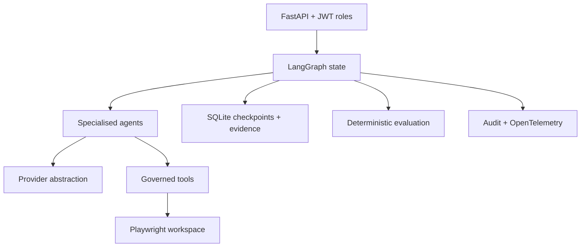

# Architecture

The platform is divided into API, orchestration, agent, deterministic tool, governance, evaluation, observability, persistence, and automation boundaries. Agents can propose structured decisions. They cannot choose arbitrary commands, write outside the approved directory, approve artifacts, or override mandatory release gates.

## State and persistence

`QEWorkflowState` owns requirement, analysis, risks, tests, coverage, regression recommendations, automation, execution, triage, evaluation, approval, release, status, retry count, and agent timeline. Each stage is checkpointed. A process can reload the JSON checkpoint into validated Pydantic objects and resume after approval.

All application queries include `tenant_id` and `project_id`. SQLite is the stable local implementation. The repository boundary can be implemented with PostgreSQL without changing agents.

## Provider boundary

Core orchestration depends on `ModelProvider`, never a vendor SDK. `MockProvider` is deterministic. Optional adapters lazy-load their SDKs and return validated Pydantic models. Schema failure receives at most one repair attempt in the OpenAI-compatible adapter; provider/policy failures stop safely.

## Tool boundary

Tools are categorised `READ_ONLY`, `EXECUTION`, `WRITE`, or `HIGH_IMPACT`. Diff extraction, lexical retrieval, artifact writing, and Playwright execution validate arguments. No `shell(command_from_llm)` capability exists.

## Playwright boundary

The Python platform writes only validated TypeScript artifacts beneath `automation/playwright/generated`. Node owns formatting, linting, type checking, discovery, and execution. The execution adapter receives a repository-generated relative path, runs one fixed Playwright invocation, and parses JSON evidence.

## Evaluation and observability

Deterministic evaluation measures schema, traceability, tools, grounding, gates, and hallucination. Qualitative judging is optional. Agent records capture prompt version, provider/model, input hash, validation, latency, tokens, and cost. Export is opt-in and secrets must be masked.

