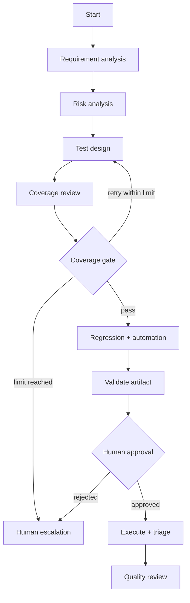

# Orchestration

LangGraph makes transitions and state explicit.

The planning graph stops in `AWAITING_APPROVAL`; this is a durable pause, not a blocking in-memory wait. The resume graph verifies a persisted approval and matching hash before execution. Every stage updates the timeline and audit trail. Maximum graph steps and repeated transitions prevent infinite loops.

Errors are reported as model, tool, validation, policy, execution, or environment failures. Unavailable models and Playwright produce explicit unavailable/not-run outcomes; they never become synthetic success.

