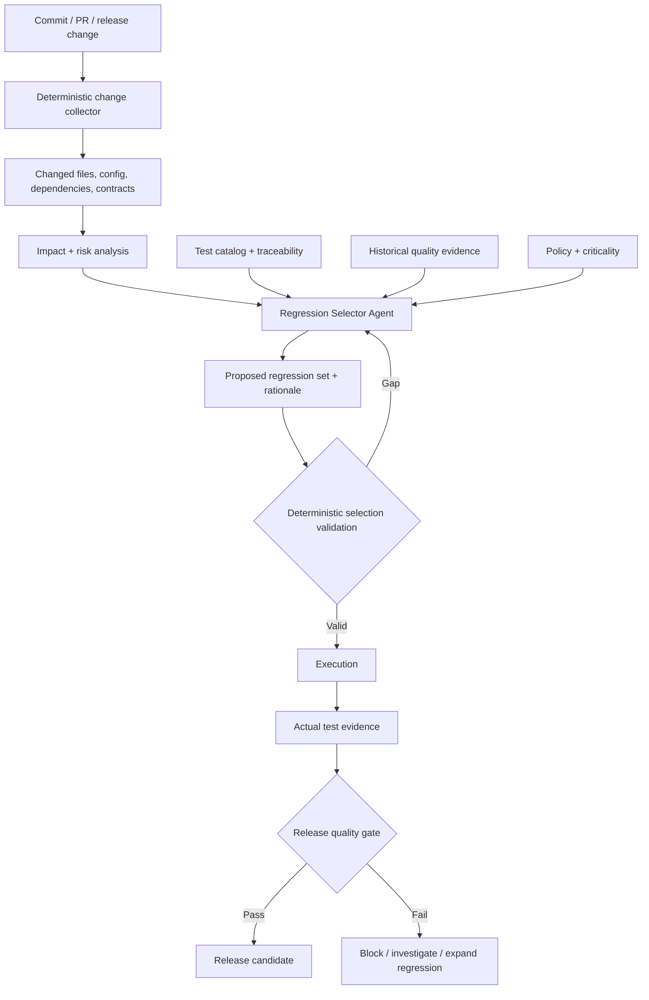

# Agentic Regression Testing

## Risk-Based Test Selection and Continuous Quality Intelligence with AI Agents

**Technical White Paper — Version 1.0**  
**September 2026**

**Author:** Ashok Kumar Manohar  
**GitHub:** [ashokmanohar-ai](https://github.com/ashokmanohar-ai)  
**Primary reference implementation:** [Agentic Quality Engineering Platform](https://github.com/ashokmanohar-ai/agentic-quality-engineering-platform)  
**Supporting implementation:** [Continuous Quality Engineering](https://github.com/ashokmanohar-ai/continuous-quality-engineering)

> **Publication note:** This is an independent technical white paper supported by open-source reference implementations. It is not a peer-reviewed academic publication, legal opinion, compliance certification, security certification, or statement of production readiness. Production use requires environment-specific engineering, security, privacy, performance and governance review.

---

## Abstract

Regression testing has traditionally been treated as a selection problem: after a change, determine which existing tests must run to establish sufficient confidence that previously working behavior has not been broken. In modern delivery systems, however, the selection problem is increasingly difficult. Codebases are large, releases are frequent, test suites are expensive, dependencies are interconnected, quality signals are distributed across functional, API, security, accessibility and performance checks, and not every change carries the same business risk.

AI agents can assist by interpreting change evidence, historical failures, requirements, test metadata, dependency relationships and quality signals. But an agent that simply “chooses some tests” introduces a new risk: the system may omit critical coverage, overstate confidence, select tests for the wrong reasons, or silently depend on hallucinated change impact.

This white paper presents **Agentic Regression Testing** as an evidence-driven Quality Engineering discipline in which AI agents assist regression analysis while deterministic change evidence, traceability, policy and release gates remain authoritative. The framework combines risk-based test selection, change-impact analysis, historical quality intelligence, deterministic coverage controls, human governance, observability and CI/CD integration.

The paper proposes a **Change–Risk–Evidence–Selection model**. Every regression decision should be able to explain: **what changed, what business or technical risk that change introduces, what evidence links the change to affected behavior, which tests were selected or excluded, what mandatory controls still apply, and how confidence will be measured after execution**.

The primary open-source reference implementation demonstrates a specialized Regression Selector agent grounded in parsed git-diff evidence, explicit LangGraph state, deterministic coverage and release gates, persisted audit evidence, bounded agent behavior and real Playwright execution. A supporting Continuous Quality Engineering implementation demonstrates deterministic path-based change-impact analysis, layered functional and non-functional evidence, flaky-test governance and transparent CI/CD release gates.

The central proposition is:

> **AI may recommend a smaller, smarter regression set, but it must never invent the change surface, override mandatory risk controls, or convert missing evidence into confidence.**

---

## 1. Executive Summary

A full regression suite is easy to understand but often expensive to execute. A highly selective suite is fast but can be dangerous when its selection logic is opaque.

The engineering goal is therefore not simply:

> Run fewer tests.

It is:

> **Run the smallest defensible set of tests that preserves the required level of risk coverage and release evidence.**

Agentic Regression Testing adds AI reasoning to this problem, but under a deterministic control plane.

A trustworthy system should separate five responsibilities:

1. **Change evidence** — determine what actually changed from source-control, configuration, dependency or deployment evidence.
2. **Risk analysis** — determine which user journeys, services, data flows, policies and non-functional qualities may be affected.
3. **Test selection** — propose the regression set and explain inclusion and exclusion decisions.
4. **Execution evidence** — run the approved set and capture actual outcomes, retries, failures and quality signals.
5. **Release policy** — apply deterministic gates so missing or failed critical evidence cannot be averaged away.

The AI agent is most useful in the reasoning layer. The authoritative facts—changed files, test identifiers, coverage mappings, criticality, hard quality gates and actual execution results—should remain deterministic wherever possible.

---

## 2. Why Regression Testing Is Becoming Harder

Modern regression testing is affected by several forces:

- high deployment frequency;
- large automated suites;
- distributed services and APIs;
- shared libraries and platform dependencies;
- feature flags and configuration changes;
- asynchronous and event-driven behavior;
- cross-browser and cross-device requirements;
- security, accessibility and performance obligations;
- expensive end-to-end environments;
- flaky or historically unstable tests;
- AI-generated code and rapidly changing prompts/models;
- incomplete architecture and traceability metadata.

A file change may affect one narrow endpoint—or an authentication library used by nearly every workflow.

A dependency update may change no application source file but still alter security or runtime behavior.

A front-end-only change may still require accessibility and visual-path validation.

A configuration change may require more regression than a large documentation-only commit.

This is why line count alone is a poor proxy for regression risk.

---

## 3. Traditional Regression Selection Approaches

Common approaches include:

### 3.1 Run everything

Advantages:

- easy to understand;
- no selection algorithm required;
- broad coverage.

Limitations:

- slow feedback;
- high compute/environment cost;
- duplicated execution;
- poor fit for frequent pull requests.

### 3.2 Static test groups

Examples:

- smoke;
- API regression;
- UI regression;
- security regression;
- nightly suite.

Useful, but often too coarse.

### 3.3 Path-based impact mapping

Example:

```text
src/auth/**        → auth + API + security + critical E2E
src/catalog/**     → catalog API + order flow
ui/**              → UI + accessibility + critical E2E
package-lock.json  → unit + API + security + smoke
```

This is deterministic and auditable, but mappings can become stale.

### 3.4 Dependency-aware selection

Uses service maps, code dependency graphs, test-to-code coverage, API contracts or ownership metadata.

Powerful, but dependent on metadata quality.

### 3.5 Historical optimization

Uses failure history, duration, flakiness and defect correlation.

Useful as supporting evidence, but history cannot prove that a new change is safe.

### 3.6 AI-assisted selection

AI can synthesize multiple forms of evidence and explain impact, but must be prevented from inventing dependencies, test IDs or source changes.

---

## 4. The Change–Risk–Evidence–Selection Model

Agentic Regression Testing should produce an auditable chain:

```text
Change
  ↓
Risk
  ↓
Evidence
  ↓
Selection
  ↓
Execution
  ↓
Quality Gate
```

For each decision, capture:

| Element | Required question |
|---|---|
| Change | What actually changed? |
| Risk | What could fail because of this change? |
| Evidence | What proves the relationship? |
| Selection | Which tests are required, recommended or excluded? |
| Execution | What actually ran and what happened? |
| Gate | Is the resulting evidence sufficient for this release context? |

This chain is more valuable than an unexplained “92% regression confidence” score.

---

## 5. Reference Architecture



The critical architecture principle is that the **change collector is not an LLM**. The agent reasons over evidence supplied by deterministic tools.

---

## 6. Deterministic Change Evidence

The agent must not decide what changed by guessing from a ticket title or pull-request description.

Useful deterministic sources include:

- git diff;
- changed file paths;
- dependency lockfile changes;
- API/schema diffs;
- database migration changes;
- feature-flag changes;
- infrastructure-as-code changes;
- environment configuration changes;
- model/prompt/embedding versions;
- deployment manifests;
- test code changes.

A normalized change record might contain:

```json
{
  "commit": "abc123",
  "changed_files": [
    "src/auth/session.ts",
    "tests/api/session.spec.ts"
  ],
  "dependency_changes": [],
  "contract_changes": [],
  "configuration_changes": [],
  "source": "git-diff"
}
```

The reference Agentic QE implementation uses parsed git-diff evidence as the source of truth for regression classification rather than allowing a model to fabricate the change surface.

---

## 7. Risk-Based Regression Selection

Risk-based testing asks a more useful question than “Which module changed?”

It asks:

> If this change is wrong, what is the likely impact and how much evidence do we require before release?

A simple engineering model is:

\[
Risk = Probability \times Impact
\]

Possible impact dimensions include:

- revenue;
- security;
- privacy;
- customer experience;
- availability;
- data integrity;
- compliance obligations;
- operational recovery;
- support burden.

The exact scoring model should be transparent and versioned.

AI can help explain risk, but deterministic code should calculate arithmetic or threshold-based risk levels whenever the inputs are structured.

---

## 8. Test Criticality

Not every test has equal release significance.

A test catalog may classify cases as:

- **Critical** — failure blocks release;
- **High** — strong release significance;
- **Medium** — important but context-dependent;
- **Low** — broad confidence or exploratory value.

Criticality can derive from:

- business process importance;
- security sensitivity;
- regulatory relevance;
- failure blast radius;
- defect history;
- architecture centrality;
- customer usage;
- recovery difficulty.

The regression agent may optimize within policy, but it should not silently exclude mandatory critical tests.

---

## 9. Test-to-Requirement Traceability

A regression selector becomes significantly more defensible when tests reference business and technical intent.

Useful relationships include:

```text
Requirement → Acceptance Criterion → Risk → Test → Automation → Execution
```

For a changed authentication component, the system should be able to identify tests tied to:

- login;
- session expiry;
- logout;
- role authorization;
- password reset;
- token refresh;
- privileged workflow access.

Traceability should use stable identifiers rather than free-text similarity alone.

---

## 10. Test-to-Code and Service Relationships

Additional evidence can include:

- code coverage maps;
- component ownership;
- API consumer/provider relationships;
- service dependency graphs;
- event-topic relationships;
- database-table usage;
- UI-to-API mappings;
- feature-to-test mappings.

AI is particularly useful for synthesizing these sources, but the original relationship evidence should remain accessible in the decision record.

---

## 11. Regression Selector Agent Contract

A regression-selection agent should have a narrow contract.

### Inputs

- deterministic change evidence;
- approved test catalog;
- traceability map;
- risk metadata;
- historical evidence;
- policy and mandatory suites.

### Outputs

- selected test IDs;
- excluded test IDs where useful;
- selection rationale;
- impacted requirements/risks;
- uncertainty or missing evidence;
- recommended escalation.

### Prohibited behavior

- inventing test IDs;
- inventing changed files;
- claiming coverage without mapped evidence;
- overriding mandatory policy;
- treating unavailable history as a passing signal;
- running arbitrary commands.

---

## 12. Selection Validation

The agent's proposal should be validated deterministically.

Examples:

- every selected test ID exists;
- every critical impacted requirement has coverage;
- mandatory suites are present;
- prohibited tests are not selected in unsupported environments;
- test type matches available environment;
- required security or accessibility evidence is included;
- duplicate tests are normalized;
- selection size remains within explicit budget only when policy permits.

A selection that fails validation should return to analysis or fail closed.

---

## 13. Inclusion and Exclusion Evidence

A mature system should explain both sides.

Example:

| Test | Decision | Evidence |
|---|---|---|
| AUTH-001 Login success | Include | `src/auth/session.ts` changed; requirement AUTH-R1 |
| AUTH-004 Role escalation | Include | High security risk; shared authorization path |
| CART-020 Coupon expiry | Exclude | No mapped dependency; no shared service change |
| PERF-AUTH-01 Login load | Include for release | Authentication path changed; release performance policy |

Exclusion rationale is important because omitted tests represent accepted residual risk.

---

## 14. Historical Quality Intelligence

Historical data can improve prioritization:

- tests that frequently catch defects;
- files historically associated with regressions;
- defect-prone components;
- recent incidents;
- frequently failing integrations;
- flaky tests;
- test durations;
- environment instability;
- previous change-impact decisions.

But history is **supporting evidence**, not truth.

A component with no previous defects is not necessarily low risk.

---

## 15. Flaky-Test Intelligence

Flakiness creates a dangerous optimization temptation: exclude unstable tests to make regression faster or greener.

That is not acceptable for critical evidence.

A better model distinguishes:

- product failure;
- test defect;
- environment failure;
- intermittent infrastructure failure;
- true behavioral instability.

Retries should remain visible.

A fail-then-pass result should not silently become equivalent to a clean pass.

The supporting Continuous Quality Engineering implementation explicitly records retry visibility and blocks critical flaky tests under its default policy.

---

## 16. Functional and Non-Functional Regression

Regression selection must not focus only on functional test cases.

Change impact may require:

- API tests;
- contract tests;
- UI/E2E tests;
- accessibility checks;
- security scans;
- performance tests;
- resilience tests;
- data validation;
- migration tests;
- observability validation.

For example, a dependency update may require security regression even when no user-visible workflow changed.

---

## 17. Security-Sensitive Changes

Security-sensitive changes should receive special treatment.

Examples:

- authentication;
- authorization;
- session handling;
- cryptography;
- secrets;
- dependency updates;
- file upload;
- external integrations;
- input validation;
- privileged APIs.

The regression agent may recommend additional security coverage, but security policy should define mandatory minimums.

---

## 18. API and Contract Regression

API changes can affect consumers beyond the modified service.

Evidence may include:

- OpenAPI diffs;
- GraphQL schema diffs;
- protobuf changes;
- Pact contracts;
- version changes;
- required/optional field changes;
- enum changes;
- status-code changes.

The selector should consider both provider and consumer impact.

---

## 19. Data and Database Changes

Schema changes can require broad regression.

Examples:

- migration scripts;
- column type changes;
- constraints;
- indexes;
- defaults;
- retention policy;
- data transformation;
- backward compatibility.

Regression should include both application behavior and migration/recovery evidence where relevant.

---

## 20. Configuration and Feature Flags

Not all important changes live in application source.

Regression systems should detect:

- environment variables;
- routing rules;
- feature flags;
- policy configuration;
- infrastructure manifests;
- timeout/retry changes;
- rate limits;
- quality thresholds.

A “small configuration change” can have a large runtime blast radius.

---

## 21. AI-System Regression

When the application itself contains AI, the regression surface expands further.

Changes may include:

- prompt versions;
- model/deployment versions;
- system instructions;
- embedding models;
- chunking configuration;
- retrieval top-k;
- reranking;
- tools and permissions;
- agent routing;
- safety policy;
- judge/evaluator versions.

These changes require evaluation datasets and quality metrics in addition to conventional software tests.

---

## 22. Regression Testing for Agentic Systems

Agent systems require trajectory-level regression.

A test may need to validate:

- correct tool selection;
- correct arguments;
- required step order;
- prohibited actions;
- approval boundaries;
- retry limits;
- safe-stop behavior;
- delegated identity;
- final state changes;
- grounding of final claims.

A fluent final answer cannot substitute for correct execution.

---

## 23. Confidence Is Not a Model Feeling

An LLM saying “high confidence” is not release evidence.

Confidence should be derived from measurable factors such as:

- critical-risk coverage;
- requirement coverage;
- selected test execution;
- pass/fail evidence;
- missing evidence;
- baseline comparison;
- unresolved defects;
- flakiness;
- security findings;
- performance thresholds.

The model may explain confidence, but policy should determine release status.

---

## 24. Regression Coverage Gates

Useful deterministic gates may include:

- 100% coverage of impacted critical requirements;
- 100% coverage of impacted critical risks;
- mandatory security suite for auth/dependency changes;
- mandatory contract tests for API-schema changes;
- no unresolved critical execution failures;
- no missing mandatory reports;
- no critical flaky tests;
- minimum overall impacted-scope coverage.

Thresholds should be versioned and risk-calibrated.

---

## 25. Adaptive Regression Expansion

A strong agentic workflow can expand the suite when evidence changes.

Example:

```text
Initial change analysis
  ↓
Run targeted regression
  ↓
Unexpected integration failure
  ↓
Expand impacted-service regression
  ↓
Run additional evidence
  ↓
Re-evaluate release gate
```

Expansion rules should be bounded and observable to prevent uncontrolled loops or cost growth.

---

## 26. Failure-Driven Selection

A failure can trigger additional tests based on evidence.

Examples:

- authentication failure → role/session/password-reset tests;
- payment failure → retry/idempotency/order-state tests;
- API contract failure → consumer contract suite;
- accessibility regression → broader component/page scan;
- memory leak → extended performance profile.

The agent can recommend the expansion, while deterministic policy controls execution scope.

---

## 27. Human-in-the-Loop Boundaries

Human approval is appropriate when regression selection affects consequential evidence, for example:

- excluding mandatory or critical tests;
- changing risk classifications;
- accepting known failures;
- approving release exceptions;
- updating production baselines;
- overriding a blocked release;
- running privileged or costly production-like tests.

Approval records should preserve actor, reason, scope, time and expiry.

---

## 28. CI/CD Operating Model

A practical pipeline can use different profiles.

### Pull request

Fast targeted evidence:

- deterministic impact analysis;
- selected unit/API/integration tests;
- critical E2E;
- mandatory security checks;
- targeted AI evaluations where applicable.

### Nightly

Broader regression:

- cross-browser;
- larger functional suite;
- security profiles;
- additional AI evaluation;
- stability analysis.

### Release

Complete risk-calibrated evidence:

- all mandatory suites;
- full critical coverage;
- performance evidence;
- security evidence;
- baseline comparison;
- approval/exception review.

Fast feedback and deep assurance should be separate profiles, not competing goals.

---

## 29. Quality Evidence Model

Each regression run should retain enough information to reproduce the decision.

Recommended fields:

- repository and commit;
- base/head refs;
- changed-file hash;
- test-catalog version;
- traceability-map version;
- risk-policy version;
- selector prompt/model version;
- selected tests;
- excluded tests/rationale;
- execution results;
- retries/flakes;
- security/performance evidence;
- gate decision;
- human approvals/exceptions;
- timestamp/environment.

---

## 30. Observability

Useful traces include:

```text
regression_decision
├── collect_change
├── map_impact
├── assess_risk
├── select_tests
├── validate_selection
├── execute_suite
├── expand_if_needed
└── release_gate
```

Agent spans should capture provider/model, prompt version, input hash, structured-output validity, latency, tokens and cost where available.

Do not log sensitive source content or secrets by default.

---

## 31. Evaluation of the Regression Agent

The regression agent itself needs regression testing.

Evaluation cases should cover:

- narrow UI change;
- authentication change;
- shared-library change;
- API contract change;
- dependency update;
- documentation-only change;
- ambiguous change;
- malformed diff;
- missing test mapping;
- security-sensitive change;
- prompt injection in PR text;
- fabricated test ID attempt;
- tenant/project isolation;
- critical test exclusion;
- failure-driven expansion;
- loop-guard behavior.

Metrics can include:

- tool correctness;
- test-ID validity;
- critical coverage;
- unsupported-reference rate;
- required-suite recall;
- unnecessary-test ratio;
- selection stability;
- end-to-end gate correctness.

---

## 32. Measuring Selection Efficiency

Regression optimization should measure both **risk preservation** and **execution reduction**.

Possible metrics:

\[
SelectionRatio = \frac{SelectedTests}{TotalEligibleTests}
\]

\[
TimeReduction = 1 - \frac{SelectedDuration}{FullSuiteDuration}
\]

But these metrics must never be read without coverage and escaped-defect measures.

A 90% reduction with poor critical-risk coverage is not success.

---

## 33. Escaped-Defect Feedback

Production and downstream defects should feed the regression system.

A mature workflow is:

```text
Incident / escaped defect
  ↓
Identify missed behavior
  ↓
Map missing test or incorrect selection
  ↓
Add permanent regression evidence
  ↓
Update traceability/risk policy if needed
  ↓
Re-evaluate historical changes
```

This creates continuous quality intelligence rather than one-time optimization.

---

## 34. Baseline Governance

Baselines should not be updated simply to make a change pass.

A baseline change should record:

- reason;
- owner;
- dataset/test-catalog version;
- previous result;
- new result;
- impact analysis;
- approval;
- rollback path.

The same principle applies to AI evaluation baselines and conventional performance thresholds.

---

## 35. Anti-Patterns

### 35.1 “Ask the LLM which tests to run”

Without deterministic evidence and validation, this is not an engineering control.

### 35.2 PR-title-driven impact

Descriptions are helpful context but not authoritative change evidence.

### 35.3 Hidden mandatory-suite overrides

Optimization must not bypass critical security, compliance or business controls.

### 35.4 Treating missing tests as low risk

Missing mapping should reduce confidence or trigger review.

### 35.5 Rewarding smallest suite size

The objective is defensible confidence, not minimum test count.

### 35.6 Ignoring non-functional regression

Functional pass alone does not establish release readiness.

### 35.7 Letting retries hide instability

Flaky evidence should remain visible.

### 35.8 Unbounded adaptive execution

Expansion requires loop guards, budgets and stop conditions.

---

## 36. Enterprise Adoption Roadmap

### Stage 1 — Deterministic impact mapping

- map changed paths to suites;
- classify test criticality;
- externalize policy;
- retain selection evidence.

### Stage 2 — Traceability and risk

- connect requirements, risks and tests;
- add service/API dependencies;
- define critical coverage gates.

### Stage 3 — Agent-assisted analysis

- add constrained regression selector;
- require structured outputs;
- validate every test ID;
- evaluate on fixed scenarios.

### Stage 4 — Continuous quality intelligence

- incorporate defect history;
- use production incidents as permanent regressions;
- add flakiness and duration data;
- introduce adaptive expansion.

### Stage 5 — Governed enterprise optimization

- cross-service dependency graph;
- tenant/project isolation;
- signed evidence/provenance;
- centralized policy;
- protected release approvals;
- measured ROI and escaped-defect feedback.

---

## 37. Suggested KPIs

### Quality preservation

- critical impacted requirement coverage;
- critical impacted risk coverage;
- escaped regression defects;
- mandatory-suite omission rate;
- incorrect exclusion rate;
- security regression escape rate.

### Efficiency

- selected/full suite ratio;
- feedback-time reduction;
- compute reduction;
- environment-hour reduction;
- median PR regression duration.

### Agent quality

- valid test-ID rate;
- required-suite recall;
- unsupported-reference rate;
- tool correctness;
- selection stability;
- escalation accuracy.

### Governance

- missing-evidence rate;
- exception rate;
- expired exception count;
- critical flake count;
- audit completeness.

---

## 38. Ownership Model

| Area | Primary accountability |
|---|---|
| Change-evidence tooling | Platform / DevEx |
| Test catalog and traceability | Quality Engineering |
| Business criticality | Product + QE |
| Security mandatory suites | Security Engineering |
| Regression agent | AI/QE Engineering |
| Evaluation dataset | QE + domain experts |
| CI/CD gate policy | QE + Platform + Risk owners |
| Release exceptions | Authorized product/risk owner |
| Production feedback | SRE/Operations + QE |

Agentic regression is a cross-functional quality system, not only a test-automation feature.

---

## 39. Reference Implementation Mapping

### Agentic Quality Engineering Platform

The primary reference implementation demonstrates:

- a dedicated Regression Selector agent;
- deterministic git-diff evidence as source of truth;
- explicit LangGraph orchestration;
- structured Pydantic outputs;
- deterministic requirement/risk coverage;
- human approval before generated automation execution;
- fixed-command Playwright execution;
- real execution-result parsing;
- failure triage and release review;
- persisted audit events and evaluation.

### Continuous Quality Engineering

The supporting implementation demonstrates:

- deterministic changed-path impact mapping;
- functional/API/integration/contract/E2E evidence;
- accessibility, security and performance evidence;
- transparent hard quality gates;
- missing-report fail-closed behavior;
- flaky-test governance;
- PR, nightly, security, performance and release workflows.

Together they illustrate a practical evolution from deterministic continuous quality toward governed agent-assisted regression intelligence.

---

## 40. Limitations

- Static path mappings can become stale.
- AI reasoning quality depends on the quality of supplied evidence.
- Historical defect data can encode organizational bias and uneven test coverage.
- Code coverage does not prove behavioral coverage.
- Dependency graphs may be incomplete.
- Test duration optimization may create environment-specific results.
- Model output remains probabilistic.
- A reference implementation cannot establish production readiness for another organization.
- Regression selection reduces evidence volume; it does not eliminate residual release risk.

---

## 41. Future Research

Useful research areas include:

- graph-based change-impact analysis;
- learned test-to-code relationships with deterministic validation;
- causal analysis of escaped defects;
- multi-agent regression planning;
- uncertainty-aware selection;
- adaptive test-budget optimization;
- semantic API-change impact;
- production-telemetry-driven regression;
- cross-repository impact analysis;
- evaluation methods for selection explanations;
- signed regression evidence and provenance.

---

## 42. Conclusion

Regression optimization is often framed as a speed problem. In enterprise Quality Engineering, it is fundamentally an **evidence-allocation problem**.

Teams have limited time, environments and compute. The challenge is to direct those resources toward the tests that provide the most defensible evidence for the risk introduced by a specific change.

AI agents can improve this process by synthesizing change evidence, requirements, risks, test mappings and quality history. But they should operate inside an engineering system where deterministic tools establish facts, structured contracts constrain outputs, mandatory policy cannot be overridden, and actual execution evidence determines the release decision.

The desired operating model is:

```text
Deterministic change evidence
        ↓
Risk-aware agent reasoning
        ↓
Validated regression selection
        ↓
Real execution evidence
        ↓
Adaptive expansion when justified
        ↓
Deterministic release governance
        ↓
Production feedback into permanent regression
```

The goal is not autonomous test reduction.

The goal is **continuous, explainable and risk-calibrated quality intelligence**.

---

## References

1. National Institute of Standards and Technology (NIST), **Artificial Intelligence Risk Management Framework (AI RMF 1.0)**, NIST AI 100-1, 2023. https://doi.org/10.6028/NIST.AI.100-1
2. National Institute of Standards and Technology (NIST), **Artificial Intelligence Risk Management Framework: Generative Artificial Intelligence Profile**, NIST AI 600-1, 2024. https://doi.org/10.6028/NIST.AI.600-1
3. National Institute of Standards and Technology (NIST), **AI Agent Standards Initiative**, launched 2026. https://www.nist.gov/artificial-intelligence/ai-agent-standards-initiative
4. Microsoft, **Playwright Documentation**. https://playwright.dev/docs/intro
5. LangChain, **LangGraph Documentation**. https://docs.langchain.com/oss/python/langgraph/overview
6. OpenTelemetry, **Documentation and Semantic Conventions**. https://opentelemetry.io/docs/
7. GitHub, **GitHub Actions Documentation**. https://docs.github.com/actions
8. OWASP, **Web Application Security Testing and Application Security Guidance**. https://owasp.org/

---

## Citation

If referencing this work, use the citation metadata in [`CITATION_AGENTIC_REGRESSION_TESTING.cff`](CITATION_AGENTIC_REGRESSION_TESTING.cff).

Suggested citation:

> Manohar, Ashok Kumar. *Agentic Regression Testing: Risk-Based Test Selection and Continuous Quality Intelligence with AI Agents*. Version 1.0, September 2026.

---

## License

This white paper is distributed with the repository under the MIT License. External standards, documentation and referenced materials remain subject to their respective terms and licenses.
