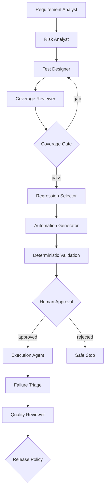

# Multi-Agent Quality Engineering

## Orchestrating Specialized AI Agents Across the Software Testing Lifecycle

**Technical White Paper — Version 1.0**  
**September 2026**

**Author:** Ashok Kumar Manohar  
**GitHub:** [ashokmanohar-ai](https://github.com/ashokmanohar-ai)  
**Reference implementation:** [Agentic Quality Engineering Platform](https://github.com/ashokmanohar-ai/agentic-quality-engineering-platform)

> **Publication note:** This is an independent technical white paper supported by an open-source reference implementation. It is not a peer-reviewed academic publication, legal opinion, security certification, compliance certification, or statement of production readiness. Production adoption requires environment-specific architecture, security, privacy, risk and governance review.

---

## Abstract

AI-assisted software testing is moving beyond isolated prompt-based tasks toward coordinated systems of specialized agents. A requirement-analysis agent can interpret acceptance criteria; a risk agent can prioritize failure impact; a test-design agent can propose traceable coverage; a regression agent can analyze change evidence; an automation agent can generate test code; an execution agent can run approved artifacts; a triage agent can analyze failures; and a quality-review agent can synthesize release evidence. This division of responsibility can improve clarity, modularity and control—but only when the system is engineered as a governed software architecture rather than a collection of autonomous prompts.

This white paper presents **Multi-Agent Quality Engineering (Multi-Agent QE)** as a practical architecture for orchestrating specialized AI agents across the software testing lifecycle while keeping deterministic engineering controls authoritative. The approach separates reasoning responsibilities, constrains tool access, uses typed state and structured contracts, preserves evidence between stages, introduces bounded retries and loop guards, requires human approval at consequential boundaries, and evaluates each agent both individually and as part of an end-to-end workflow.

The paper proposes a **Role–Evidence–Control model** for multi-agent testing systems. Every agent must have a narrow role, explicit inputs and outputs, permitted tools, prohibited actions, deterministic validation, stop conditions, retry limits, evidence requirements, security context, and escalation path. The orchestrator—not the language model—owns workflow state transitions and release-critical policy.

A companion open-source reference implementation demonstrates nine specialized Quality Engineering agents for requirement analysis, risk analysis, test design, coverage review, regression selection, automation generation, test execution, failure triage and quality review. The implementation includes explicit LangGraph state, Pydantic contracts, deterministic quality gates, hash-bound human approval, fixed-command Playwright execution, persisted checkpoints, RBAC and tenant scope, audit events, offline agent evaluation and CI/CD quality gates.

The central proposition is:

> **A multi-agent Quality Engineering system is trustworthy only when every agent has a bounded responsibility, every handoff carries verifiable evidence, deterministic policy controls consequential actions, and the complete workflow can explain how it reached its testing and release decisions.**

---

## 1. Executive Summary

The software testing lifecycle already contains specialized engineering responsibilities:

```text
Requirements
   ↓
Risk Analysis
   ↓
Test Design
   ↓
Coverage Review
   ↓
Regression Selection
   ↓
Automation
   ↓
Execution
   ↓
Failure Triage
   ↓
Quality / Release Review
```

A single general-purpose AI agent can attempt all of these activities, but that design creates several problems:

- one prompt accumulates too many responsibilities;
- hidden assumptions move silently between stages;
- tool privileges tend to become broader than necessary;
- one hallucinated fact can contaminate downstream work;
- failures become difficult to localize;
- evaluation becomes ambiguous because many responsibilities share one score;
- retries can repeat entire workflows rather than a single failed stage;
- human approval points are difficult to define;
- release recommendations may become dependent on opaque model reasoning.

A multi-agent architecture addresses these concerns by decomposing the workflow into smaller, independently testable responsibilities.

However, **more agents do not automatically mean better engineering**. Poor multi-agent systems can introduce additional risks:

- circular delegation;
- inconsistent shared state;
- agent-to-agent prompt injection;
- duplicated work;
- conflicting recommendations;
- uncontrolled retries;
- privilege escalation across tools;
- cascading hallucinations;
- excessive token and latency cost;
- unclear accountability.

Multi-Agent QE therefore needs an explicit control architecture.

This paper recommends seven core principles:

1. **Specialize agents by responsibility, not personality.**
2. **Keep workflow state explicit and machine-readable.**
3. **Validate every handoff with deterministic contracts.**
4. **Give each agent only the tools and data required for its role.**
5. **Treat human approval as a formal state transition for consequential actions.**
6. **Evaluate agents individually and as an orchestrated system.**
7. **Keep release-critical policy outside probabilistic model reasoning.**

---

## 2. What Is Multi-Agent Quality Engineering?

**Multi-Agent Quality Engineering** is the use of multiple specialized AI agents to assist distinct Quality Engineering responsibilities within a governed orchestration framework.

It is not simply:

- multiple prompts;
- multiple chatbot personas;
- several models calling each other;
- a supervisor agent delegating arbitrary work;
- a swarm of autonomous workers;
- one model with different system messages.

A production-oriented Multi-Agent QE system contains at least four architectural layers:

```text
┌──────────────────────────────────────────────┐
│ Governance / Policy / Human Authority        │
├──────────────────────────────────────────────┤
│ Orchestration / State / Routing / Checkpoint │
├──────────────────────────────────────────────┤
│ Specialized QE Agents                        │
├──────────────────────────────────────────────┤
│ Deterministic Tools / Evidence / Test Systems│
└──────────────────────────────────────────────┘
```

The agents reason and propose. The orchestration layer coordinates. Deterministic components calculate, validate and execute. Governance defines what the system is allowed to do.

---

## 3. Why Specialization Matters

The strongest reason for multi-agent decomposition is not that different models have different personalities. It is that **different engineering responsibilities require different evidence and controls**.

For example:

| Responsibility | Primary question | Best evidence |
|---|---|---|
| Requirement analysis | What does the requirement actually state? | Requirement text, criteria, source IDs |
| Risk analysis | What could fail and how serious is it? | Probability, impact, business context |
| Test design | What must be tested? | Requirements, risks, acceptance criteria |
| Coverage review | What remains untested? | Traceability IDs and deterministic counts |
| Regression selection | What existing tests are affected? | Parsed code/change evidence |
| Automation generation | How can tests be implemented? | Approved scenarios, DOM/API contracts |
| Execution | What actually happened? | Real runner output |
| Failure triage | Why did it fail? | Logs, traces, screenshots, errors |
| Quality review | Is release evidence sufficient? | All validated upstream evidence |

Trying to answer all nine questions in one free-form model invocation makes it harder to prove which evidence influenced which decision.

Specialization creates boundaries that can be tested.

---

## 4. Reference Multi-Agent QE Lifecycle

The reference implementation uses nine agents:



This architecture deliberately mixes probabilistic and deterministic components.

Agents are used where interpretation and synthesis are useful. Code owns:

- risk-score arithmetic;
- traceability percentages;
- mandatory coverage thresholds;
- artifact hashes;
- role checks;
- allowed file paths;
- command execution;
- Playwright result parsing;
- release blockers.

---

## 5. The Role–Evidence–Control Model

Every agent should be described through three dimensions.

### 5.1 Role

The agent must have one primary engineering responsibility.

Examples:

- interpret requirements;
- propose risk;
- generate test cases;
- classify regression impact;
- generate automation;
- triage failures.

An agent should not receive unrelated privileges simply because it might be useful later.

### 5.2 Evidence

Every output must identify what evidence supports it.

Examples:

- requirement IDs;
- acceptance-criterion IDs;
- risk IDs;
- changed files;
- source-document IDs;
- generated artifact hash;
- Playwright result records;
- trace IDs.

### 5.3 Control

Every responsibility needs deterministic safeguards.

Examples:

- schema validation;
- allow-listed tools;
- path restrictions;
- coverage thresholds;
- human approval;
- retry budgets;
- authorization checks;
- safe fallback states.

An agent contract can therefore be modeled as:

```text
Agent Contract =
    Role
  + Inputs
  + Structured Output
  + Evidence Requirements
  + Allowed Tools
  + Prohibited Actions
  + Deterministic Validators
  + Stop Conditions
  + Retry Budget
  + Security Context
  + Escalation Path
```

---

## 6. Agent Contracts Should Be Machine-Readable

Natural-language agent descriptions are insufficient for enterprise orchestration.

The orchestrator should know exactly what shape each agent produces.

For example:

```json
{
  "requirement_id": "REQ-101",
  "acceptance_criteria": [
    {
      "id": "AC-1",
      "text": "Reset link expires after 15 minutes"
    }
  ],
  "ambiguities": [],
  "source_ids": ["REQ-101"]
}
```

A downstream risk agent should not receive an unstructured paragraph if the workflow depends on stable identifiers.

Structured contracts provide:

- schema validation;
- backward compatibility checks;
- explicit versioning;
- deterministic routing;
- easier replay;
- better regression testing;
- safer inter-agent communication.

Malformed output should fail explicitly rather than be silently repaired by another model.

---

## 7. Orchestration Must Own State

The orchestration layer should be the system of record for workflow state.

An agent should not decide that the workflow has advanced simply because it claims completion.

Example state model:

```text
RECEIVED
  ↓
REQUIREMENT_ANALYZED
  ↓
RISK_ANALYZED
  ↓
TESTS_DESIGNED
  ↓
COVERAGE_PASSED
  ↓
REGRESSION_SELECTED
  ↓
AUTOMATION_PROPOSED
  ↓
AUTOMATION_VALIDATED
  ↓
AWAITING_APPROVAL
  ↓
APPROVED
  ↓
EXECUTED
  ↓
TRIAGED
  ↓
QUALITY_REVIEWED
  ↓
COMPLETE
```

Possible safe terminal states include:

```text
BLOCKED
REJECTED
FAILED_VALIDATION
INSUFFICIENT_EVIDENCE
UNKNOWN
```

Explicit state makes workflows observable and resumable.

---

## 8. Requirement Analyst

The Requirement Analyst should extract facts, not invent missing requirements.

### Inputs

- approved requirement source;
- acceptance criteria;
- business rules;
- optional project knowledge.

### Outputs

- normalized requirements;
- acceptance-criterion IDs;
- ambiguity list;
- missing-information flags;
- source references.

### Deterministic controls

- empty-source detection;
- duplicate IDs;
- minimum required fields;
- source existence;
- malformed criteria.

### Failure rule

If critical information is missing, the agent should expose uncertainty rather than complete the requirement on behalf of the product owner.

---

## 9. Risk Analyst

The Risk Analyst converts known requirements into explicit risk hypotheses.

It may propose:

- probability;
- impact;
- rationale;
- affected flows;
- suggested tests.

But numeric risk calculation should remain deterministic.

For example:

\[
RiskScore = Probability \times Impact
\]

The model may explain why a failure appears high impact. It should not secretly redefine the risk scale.

---

## 10. Test Designer

The Test Designer should generate traceable cases from approved requirement and risk evidence.

Every case should reference:

- requirement ID;
- acceptance criterion;
- risk where applicable;
- test type;
- preconditions;
- steps or intent;
- expected result;
- priority.

A useful contract prevents orphan tests and unsupported scenarios.

A generated scenario without a source should be treated as a hypothesis requiring review—not automatically as a valid requirement.

---

## 11. Coverage Reviewer

Coverage review is an excellent example of separating AI interpretation from deterministic measurement.

The agent may explain gaps, but coverage should be computed from identifiers.

Examples:

\[
RequirementCoverage = \frac{CoveredRequirements}{TotalRequirements}
\]

\[
CriticalRiskCoverage = \frac{CoveredCriticalRisks}{TotalCriticalRisks}
\]

A language model should not estimate that coverage is "around 95%."

If the policy requires 100% critical coverage, code should enforce it.

---

## 12. Regression Selector

Regression selection should be grounded in actual change evidence.

Inputs may include:

- parsed git diff;
- changed files;
- service/API ownership;
- requirement links;
- existing test metadata;
- historical failure evidence.

The agent can reason about likely impact, but it should not invent changed files or dependencies.

The deterministic change parser remains the source of truth.

---

## 13. Automation Generator

Automation generation is a high-leverage but high-risk stage.

The agent can propose Playwright or API automation from approved test designs, but generated code should pass independent controls before execution.

Recommended controls include:

- dedicated generated-code directory;
- path normalization;
- no arbitrary filesystem writes;
- no shell APIs;
- no embedded secrets;
- no unbounded waits;
- static policy checks;
- linting;
- type checking;
- test discovery;
- compilation;
- artifact hashing.

Generated code is a proposal until it passes validation and approval.

---

## 14. Human Approval as a Workflow Boundary

Consequential automation should not execute merely because the generating agent recommends it.

A strong approval model binds approval to the exact artifact.

```text
Generated code
   ↓
Static validation
   ↓
SHA-256 artifact hash
   ↓
Human review
   ↓
Approval(hash, approver, time, scope)
   ↓
Execution verifies same hash
```

If the artifact changes after approval, the approval must become invalid.

This prevents approval of one version followed by execution of another.

---

## 15. Execution Agent

The Execution Agent should have less freedom than the Automation Generator.

Its role is not to invent commands. It should execute only approved, fixed commands against an approved artifact.

For example:

```text
Allowed:
  npx playwright test generated/test-123.spec.ts --reporter=json

Not allowed:
  <arbitrary model-generated shell command>
```

Execution evidence should come from the actual runner:

- exit status;
- passed/failed tests;
- duration;
- retries;
- traces;
- screenshots;
- videos;
- logs;
- structured report.

A model statement such as "all tests passed" is not execution evidence.

---

## 16. Failure Triage Agent

Failure triage is a probabilistic classification problem.

Possible classes include:

- product defect;
- automation defect;
- data issue;
- environment issue;
- service dependency;
- network issue;
- unknown.

The agent should distinguish **evidence** from **hypothesis**.

Example:

```json
{
  "classification": "environment_issue",
  "confidence": 0.71,
  "evidence": ["HTTP 503 from dependency X"],
  "hypothesis": "dependency maintenance may be active",
  "recommended_action": "check service health"
}
```

Low-confidence cases should resolve to `UNKNOWN` rather than a confident guess.

---

## 17. Quality Reviewer

The Quality Reviewer can synthesize upstream evidence into an executive explanation.

However, it must not override mandatory gates.

Examples of deterministic blockers:

- critical requirement coverage failed;
- approved automation did not execute;
- critical test failed;
- unresolved product defect remains;
- security policy failed;
- mandatory evidence missing.

The agent can explain the decision. It should not change the decision from `FAIL` to `PASS` because the overall result "looks acceptable."

---

## 18. Inter-Agent Handoffs Are Security Boundaries

Agent-to-agent communication should be treated as untrusted structured data.

The receiving agent should not blindly interpret the previous agent's natural-language output as authoritative instruction.

Recommended protections:

- structured schemas;
- source IDs;
- immutable evidence fields;
- normalized identifiers;
- explicit provenance;
- content delimiters;
- instruction/data separation;
- signature/hash for high-impact artifacts;
- validation before routing.

A downstream agent should know whether a field is:

- user input;
- retrieved evidence;
- calculated value;
- model proposal;
- approved decision.

Those categories should not be interchangeable.

---

## 19. Tool Permissions Should Follow Least Privilege

Different agents require different tool access.

Example:

| Agent | Read requirements | Read git diff | Generate code | Execute tests | Approve | Release override |
|---|---:|---:|---:|---:|---:|---:|
| Requirement Analyst | ✓ |  |  |  |  |  |
| Risk Analyst | ✓ |  |  |  |  |  |
| Test Designer | ✓ |  |  |  |  |  |
| Regression Selector | ✓ | ✓ |  |  |  |  |
| Automation Generator | ✓ |  | ✓ |  |  |  |
| Execution Agent |  |  |  | ✓ |  |  |
| Failure Triage |  |  |  | Read evidence |  |  |
| Quality Reviewer | Read evidence |  |  |  |  |  |
| Human Approver | Read artifact |  |  |  | ✓ | governed separately |

A multi-agent system should not share one privileged tool bundle among every agent.

---

## 20. Identity, Authorization and Delegation

Multi-agent systems create questions that ordinary application testing often avoids:

- Which identity is an agent acting under?
- Does an agent inherit the user's privileges?
- Can one agent delegate authority to another?
- Does the second agent receive the same scope?
- Can a planner grant a worker new permissions?
- How are tenant and project boundaries preserved?

The secure default is:

> **Delegation does not create authority.**

Every tool action should be authorized using the effective principal, resource scope and requested operation.

This aligns with NIST's 2026 work on software and AI agent identity and authorization, which emphasizes applying identity standards and authorization controls to agent access across tools and applications.

---

## 21. Memory and Context Isolation

Multi-agent systems can accumulate several forms of memory:

- workflow state;
- short-term conversation context;
- retrieved project knowledge;
- previous tool results;
- historical agent outputs;
- user preferences;
- cross-run memory.

These should not be treated as one undifferentiated context window.

Important tests include:

- tenant A data never appears in tenant B context;
- project state does not leak across workflows;
- superseded evidence is not silently reused;
- temporary secrets are not persisted;
- agent memory cannot bypass current authorization;
- rejected or invalid artifacts do not become trusted memory.

---

## 22. Routing Should Be Deterministic Where Possible

A model-based supervisor is not always necessary.

If the workflow is known, explicit routing is safer:

```text
Requirement Analyst
   ↓
Risk Analyst
   ↓
Test Designer
```

Use model-based routing only where the routing problem is genuinely semantic.

Even then:

- available routes should be allow-listed;
- route outputs should be schema-constrained;
- invalid routes should fail closed;
- transitions should be logged;
- retry budgets should be bounded.

---

## 23. Conflict Resolution

Specialized agents can disagree.

Examples:

- Risk Analyst marks a flow critical; Test Designer treats it low priority.
- Coverage Reviewer says evidence is incomplete; Quality Reviewer recommends release.
- Triage Agent says environment issue; execution logs indicate assertion failure.

Conflict resolution should follow evidence authority, not agent confidence.

A practical hierarchy is:

```text
Deterministic evidence
   > approved business policy
   > authoritative source data
   > human decision
   > calibrated model assessment
   > uncalibrated model opinion
```

The orchestrator should route unresolved conflicts to review rather than average them.

---

## 24. Retry Budgets and Loop Guards

Multi-agent loops can become expensive and unsafe.

Examples:

```text
Test Designer → Coverage Reviewer → Test Designer → ...
Automation Generator → Validator → Generator → ...
Triage → Retry Execution → Triage → ...
```

Every loop should have:

- maximum iterations;
- reason codes;
- progress criteria;
- budget limits;
- safe terminal state;
- escalation path.

A retry that produces no meaningful improvement should stop.

---

## 25. Deterministic-First Evaluation

Not every agent property needs an LLM judge.

### Deterministic examples

- schema validity;
- ID traceability;
- required-tool usage;
- forbidden-tool absence;
- exact tool arguments;
- state-transition validity;
- coverage arithmetic;
- artifact hash match;
- approval ordering;
- command allow-list compliance;
- execution result parsing.

### Semantic examples

- clarity of risk rationale;
- quality of test intent;
- usefulness of triage explanation;
- completeness of an executive summary.

LLM-as-a-Judge should be reserved for genuinely semantic dimensions and calibrated against human labels.

---

## 26. Evaluate Agents Individually

Each agent requires targeted evaluation data.

### Requirement Analyst dataset

- clear requirements;
- ambiguous requirements;
- conflicting acceptance criteria;
- missing fields;
- prompt injection inside requirement text.

### Risk Analyst dataset

- high-impact financial flows;
- low-risk cosmetic changes;
- authentication/security cases;
- misleading requirement wording.

### Automation Generator dataset

- safe code generation;
- prohibited path traversal;
- embedded-secret attempts;
- brittle XPath;
- arbitrary shell command attempts.

### Triage dataset

- product defect;
- automation failure;
- environment outage;
- network error;
- ambiguous evidence;
- insufficient evidence.

Agent-level evaluation localizes regressions.

---

## 27. Evaluate the Full Trajectory

A system can contain individually competent agents and still produce a bad workflow.

End-to-end evaluation should inspect:

- correct agent order;
- required stage completion;
- evidence preservation;
- forbidden transitions;
- approval before execution;
- retry count;
- final release-policy outcome;
- state consistency;
- token/latency totals;
- audit completeness.

The trajectory is a first-class test artifact.

---

## 28. Security Testing for Multi-Agent QE

Agentic architectures expand the attack surface.

OWASP's **Top 10 for Agentic Applications 2026** highlights risks including agent goal hijacking, tool misuse, identity and privilege abuse, agentic supply-chain vulnerabilities and unexpected code execution.

For Multi-Agent QE, useful adversarial scenarios include:

### Goal hijacking

A requirement or retrieved document contains instructions attempting to redirect an agent away from its role.

### Tool misuse

An agent invokes a legitimate tool for an unauthorized operation.

### Identity and privilege abuse

A low-privilege agent attempts to perform an approver or executor action.

### Supply-chain poisoning

A prompt template, tool description, model integration or external dependency changes behavior unexpectedly.

### Unexpected code execution

Generated automation attempts to invoke shell commands, write outside the workspace or load unsafe code.

### Cross-agent contamination

One compromised agent's output attempts to manipulate downstream agents.

Security tests should become permanent regression cases after remediation.

---

## 29. Human-in-the-Loop Controls

Human oversight should be concentrated at consequential transitions rather than inserted randomly throughout the workflow.

Examples:

- acceptance of unresolved requirement ambiguity;
- approval of generated automation;
- execution against production-like environments;
- acceptance of critical residual risk;
- release exception.

Approval must include:

- approver identity;
- role;
- artifact or decision hash;
- timestamp;
- scope;
- reason;
- expiry where applicable.

A rejected approval should produce a safe stop.

---

## 30. Observability

Multi-agent systems need more than one request/response log.

Recommended spans:

```text
workflow
├── requirement_analysis
├── risk_analysis
├── test_design
├── coverage_review
├── regression_selection
├── automation_generation
├── automation_validation
├── approval_wait
├── execution
├── failure_triage
└── quality_review
```

Useful metadata includes:

- workflow ID;
- tenant/project ID;
- agent name/version;
- provider/model;
- prompt version;
- input hash;
- output-schema status;
- tool calls;
- evidence IDs;
- latency;
- tokens;
- cost;
- retry count;
- approval state;
- final outcome.

Sensitive content should be minimized and masked before export.

---

## 31. CI/CD Quality Gates

Agent changes should be treated like software changes.

Pull-request gates can include:

```text
Static checks
   ↓
Unit tests
   ↓
Agent contract tests
   ↓
Security tests
   ↓
Offline multi-agent evaluation
   ↓
Automation lint/typecheck
   ↓
Playwright tests
   ↓
Container build
   ↓
Quality gate
```

Critical agent regressions should block merge.

Examples:

- traceability drops below threshold;
- approval ordering fails;
- forbidden tool appears;
- cross-tenant case fails;
- structured validity regresses;
- unsupported-reference rate increases beyond policy;
- loop guard fails.

---

## 32. Multi-Agent Quality Metrics

A useful scorecard separates layers rather than hiding everything inside one number.

| Dimension | Example metric |
|---|---|
| Contract quality | Structured-output validity |
| Traceability | Requirement/risk/test link completeness |
| Tool correctness | Correct required tool usage |
| Safety | Forbidden action count |
| Authorization | Unauthorized action success rate |
| Routing | Valid state-transition rate |
| Loop control | Max-iteration violations |
| Grounding | Unsupported-reference rate |
| Approval | Approval-before-action compliance |
| Execution | Actual runner evidence completeness |
| Triage | Calibrated classification accuracy |
| Stability | Repeat-run outcome variance |
| Efficiency | Calls/tokens per completed workflow |
| Performance | P50/P95 workflow latency |
| Cost | Cost per completed workflow |

Critical safety metrics should be hard gates, not weighted averages.

---

## 33. Performance and Cost

Multi-agent decomposition increases orchestration overhead.

Total workflow latency can be approximated as:

\[
T_{workflow} = \sum T_{agent} + \sum T_{tool} + T_{routing} + T_{approval}
\]

Total model cost can be approximated as:

\[
C_{workflow} = \sum_{i=1}^{n}(Tokens_i \times Price_i)
\]

Optimization should focus on evidence value, not simply reducing the number of agents.

Useful strategies include:

- deterministic routing;
- smaller models for narrow tasks;
- caching immutable evidence;
- parallelizing independent reads;
- skipping agents when no work is required;
- bounded context;
- structured outputs;
- reusing validated deterministic calculations.

---

## 34. Parallelism: Use Carefully

Some QE activities can run in parallel.

For example:

```text
             ┌→ Security Test Design
Requirement ─┼→ Functional Test Design
             └→ Non-Functional Risk Analysis
```

Parallelism is appropriate only when tasks do not depend on each other's outputs.

Risks include:

- duplicate cases;
- inconsistent assumptions;
- race conditions in shared state;
- ordering-sensitive tool actions;
- conflicting writes.

Parallel agent results should converge through deterministic merge and conflict rules.

---

## 35. Anti-Patterns

### 35.1 The Super-Agent

One agent analyzes requirements, generates code, executes tests and decides release.

**Problem:** excessive responsibility and privilege concentration.

### 35.2 Persona-Only Agents

Agents differ only by names such as "Senior Tester" and "Reviewer."

**Problem:** no real control boundary.

### 35.3 Shared Omnipotent Tool Set

Every agent receives every available tool.

**Problem:** least privilege disappears.

### 35.4 Model-Owned Routing

The model can jump to any stage.

**Problem:** policy becomes probabilistic.

### 35.5 Free-Text Handoffs

Downstream agents must infer identifiers and status from prose.

**Problem:** weak traceability and injection resistance.

### 35.6 Infinite Reflection

Agents repeatedly critique and regenerate until they "feel confident."

**Problem:** uncontrolled loops, cost and false confidence.

### 35.7 Average-Score Governance

Critical authorization failure is hidden by a high overall score.

**Problem:** unsafe failures are averaged away.

### 35.8 Agent-Reported Execution

The agent says tests passed without real runner evidence.

**Problem:** narrative replaces proof.

---

## 36. Enterprise Adoption Roadmap

### Phase 1 — Assistive specialization

Use agents for low-risk read-only tasks:

- requirement summarization;
- test-design suggestions;
- risk brainstorming;
- failure summarization.

Human engineers remain the execution authority.

### Phase 2 — Structured workflow

Introduce:

- typed contracts;
- explicit state;
- traceability;
- agent-level evaluations;
- deterministic routing;
- audit logs.

### Phase 3 — Governed automation generation

Add:

- generated Playwright/API tests;
- static validation;
- safe paths;
- human approval;
- fixed execution commands.

### Phase 4 — Evidence-driven execution and triage

Add:

- real test execution;
- structured evidence;
- failure triage;
- confidence fallback;
- observability.

### Phase 5 — Continuous agentic quality control

Integrate:

- CI/CD evaluation gates;
- baselines;
- security regression packs;
- production feedback;
- model/prompt/version comparison;
- governed release recommendations.

---

## 37. Operating Model and Ownership

Multi-Agent QE spans multiple organizational responsibilities.

| Area | Typical owner |
|---|---|
| Product requirements | Product / Business |
| QE workflow | Quality Engineering |
| Agent architecture | AI / Platform Architecture |
| Tool authorization | Platform / Security |
| Evaluation datasets | QE + Domain Experts |
| Security testing | Security + QE |
| Model/provider configuration | AI Platform |
| Human approval policy | Business/Risk Owner |
| Release gate | Product + QE |
| Audit/observability | Platform / SRE |

No single team should silently own every risk decision simply because it operates the agents.

---

## 38. Reference Implementation

The companion [Agentic Quality Engineering Platform](https://github.com/ashokmanohar-ai/agentic-quality-engineering-platform) demonstrates the principles described in this paper.

Key implementation characteristics include:

- nine specialized QE agents;
- explicit LangGraph orchestration;
- persisted checkpoints;
- Pydantic v2 structured contracts;
- deterministic risk and coverage calculations;
- risk-based regression grounded in parsed git diff evidence;
- Playwright TypeScript generation;
- static code policy;
- lint/typecheck/discovery validation;
- hash-bound human approval;
- fixed-command Playwright execution;
- real JSON result parsing;
- evidence-aware failure triage;
- `UNKNOWN` fallback for low confidence;
- RBAC and tenant/project scope;
- audit events;
- token/latency/model metadata;
- offline evaluation dataset;
- GitHub Actions quality gates;
- OpenTelemetry-ready observability.

The repository uses synthetic/reference data and is intended as an engineering demonstration, not a production certification.

---

## 39. Current Standards and Guidance

Multi-agent systems are evolving rapidly, but several current references are particularly relevant.

### NIST AI Agent Standards Initiative

NIST launched the **AI Agent Standards Initiative** in February 2026 to support secure, interoperable agent adoption. The initiative includes work on agent security, identity and authorization.

- [NIST AI Agent Standards Initiative](https://www.nist.gov/artificial-intelligence/ai-agent-standards-initiative)

### NIST Agent Identity and Authorization

NIST's 2026 concept work on software and AI agent identity and authorization highlights the need to apply identity standards and authorization controls when agents interact with enterprise data, tools and applications.

- [NIST: Accelerating the Adoption of Software and AI Agent Identity and Authorization](https://csrc.nist.gov/pubs/other/2026/02/05/accelerating-the-adoption-of-software-and-ai-agent/ipd)

### OWASP Top 10 for Agentic Applications 2026

OWASP's Agentic Top 10 addresses security risks for autonomous systems that plan, act and coordinate across workflows.

- [OWASP Top 10 for Agentic Applications 2026](https://genai.owasp.org/resource/owasp-top-10-for-agentic-applications-for-2026/)

### OWASP Agentic Security and Governance

OWASP also publishes guidance on security and governance across the agentic AI lifecycle.

- [OWASP State of Agentic AI Security and Governance](https://genai.owasp.org/resource/state-of-agentic-ai-security-and-governance/)

### NIST AI Risk Management Framework

The NIST AI RMF remains useful for structuring governance, mapping risk, measurement and risk management activities.

- [NIST AI Risk Management Framework](https://www.nist.gov/itl/ai-risk-management-framework)

---

## 40. Limitations

Multi-Agent QE does not eliminate the limitations of generative AI.

Important limitations include:

- model output remains probabilistic;
- orchestration adds operational complexity;
- agent specialization can increase latency and cost;
- semantic evaluation still requires calibration;
- weak source data produces weak downstream evidence;
- human approval can become ceremonial if poorly designed;
- cross-agent interactions introduce new failure modes;
- production identity and authorization require enterprise integration;
- local reference implementations do not prove production scale;
- release recommendations remain advisory unless integrated with organizational governance.

A multi-agent architecture should be justified by measurable control or quality benefits—not by architectural novelty.

---

## 41. Future Research

Areas requiring deeper engineering and research include:

- standardized agent-to-agent evidence contracts;
- delegated identity across multi-agent workflows;
- cryptographic provenance for inter-agent artifacts;
- scalable multi-agent trajectory evaluation;
- causal attribution of downstream failures to upstream agents;
- automated conflict resolution with policy constraints;
- cost-aware agent routing;
- formal verification of state transitions;
- safe cross-framework agent interoperability;
- adversarial testing of agent memory and shared state;
- multi-agent reliability under partial tool failure;
- production drift detection for agent workflows.

---

## 42. Conclusion

Multi-Agent Quality Engineering can turn AI-assisted testing from a collection of prompts into an observable, testable and governable engineering workflow.

The key architectural shift is not simply from **one agent to many agents**.

It is from:

```text
One opaque model doing everything
```

to:

```text
Specialized responsibility
+ explicit state
+ structured evidence
+ deterministic controls
+ least privilege
+ human authority
+ independent evaluation
+ auditable release policy
```

Quality Engineering is well suited to this model because testing already depends on specialization, traceability, evidence, repeatability and controlled release decisions.

The strongest multi-agent architecture is therefore not the one with the most autonomous agents. It is the one in which each agent has the **least authority necessary**, every handoff is **provable**, every high-impact action is **governed**, and the system can explain exactly **how evidence moved from requirement to release decision**.

---

## Suggested Citation

**Manohar, Ashok Kumar. (2026). _Multi-Agent Quality Engineering: Orchestrating Specialized AI Agents Across the Software Testing Lifecycle_. Version 1.0.**

Repository: [https://github.com/ashokmanohar-ai/agentic-quality-engineering-platform](https://github.com/ashokmanohar-ai/agentic-quality-engineering-platform)

---

## License

This white paper is distributed with the reference repository under the repository's MIT License. Third-party standards, frameworks, products and trademarks remain subject to their respective terms and licenses.
